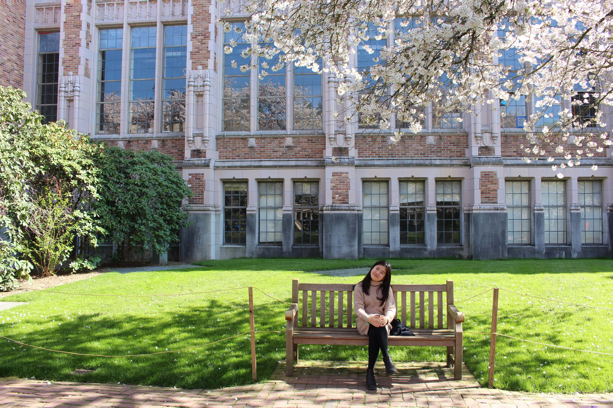

## About

Hello! :cloud: Professionally trained as an architect, I am a ==UIUX / Product designer==. My job revolves around Branding, Interaction Design, User Experience-design, and Visual Design. I build meaningful experiences, connect users and increase system efficiency through design.

[Linkedin](https://my.linkedin.com/in/wen-qian-chua-a1a6451b0)

[Behance](https://www.behance.net/qianmade14c5)

[Issuu](https://issuu.com/wenqianchua)

## Things I Love

>Painting

<iframe width="560" height="315" src="https://www.youtube.com/embed/qfFADpYqJtQ?start=26" title="YouTube video player" frameborder="0" allow="accelerometer; autoplay; clipboard-write; encrypted-media; gyroscope; picture-in-picture" allowfullscreen></iframe>

>Playing Musical Instruments

<iframe width="560" height="315" src="https://www.youtube.com/embed/dwzLctcK_wU?start=55" title="YouTube video player" frameborder="0" allow="accelerometer; autoplay; clipboard-write; encrypted-media; gyroscope; picture-in-picture" allowfullscreen></iframe>