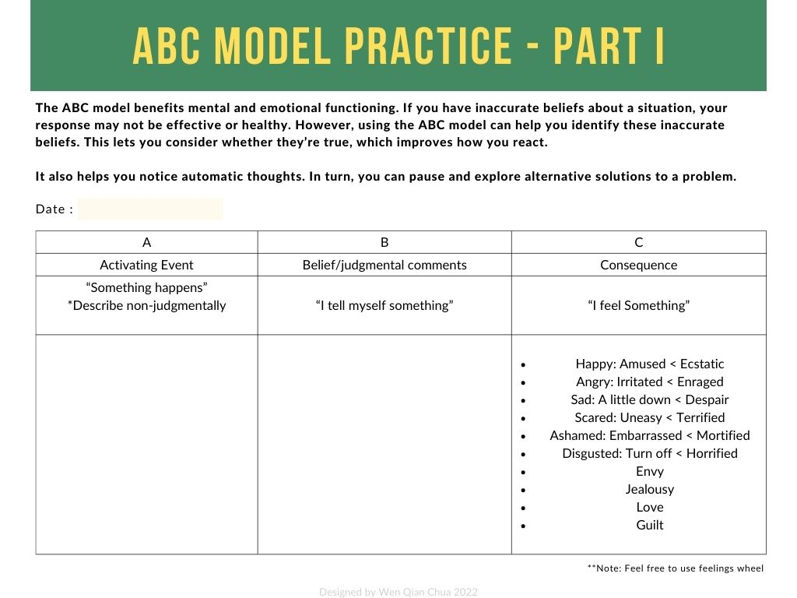
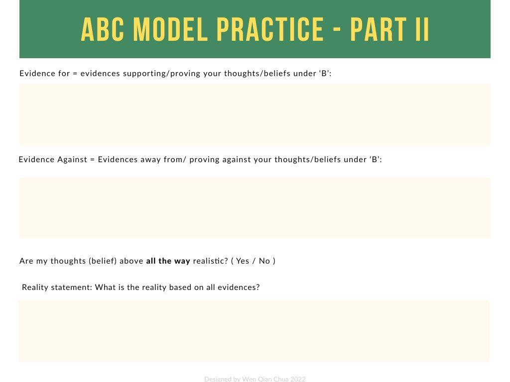

# Self-care Resources

>This will be some printable work sheets for people who might find it useful.

*Disclaimer: I am not a mental health professional, these resources are just something that I have collected over the years. For any serious issues please find a healthcare provider for professional advise.*

## Prevention and Crisis

### Hope Box

Please find attached a downloadable PDF for the Virtual Hope Box. Feel free to follow the instructions in the PDF to build your very own hope box.

>Hope Box PDF
[download](../files/pdf/Self%20Care/Grief%20and%20Loss%20Coping.pdf)

## Maintainence

Here, you will find some printable PDF work sheets for maintainence exercises.

### ABC Cognitive Behavioral Therapy Work Sheet

When filling in the evidence for and evidence against in this ABC worksheet, make sure all evidences are concrete, detailed and non-subjective facts.

>ABC Worksheet PDF
[download](../files/pdf/Self%20Care/ABC%20Model.pdf)

### Anxiety Tracking

>Anxiety Tracking PDF
[download](../files/pdf/Self%20Care/Anxiety.pdf)

### Self Care Check List

>Self Care PDF
[download](../files/pdf/Self%20Care/Self%20Care.pdf)

## Fact Sheets

These will be some printable fact sheets that can serve as a reminder whenever you need it. You can keep some of them in your Hope Box, or paste it somewhere that you can see it everyday. One day, you will no longer need them. Everyone can heal. Have faith.

### Calming Extreme Emotions

>Calming Down Extreme Emotions PDF
[download](../files/pdf/Self%20Care/Fact%20Sheets/extreme.pdf)

### Mindful Eating

>Mindful Eating Guide PDF
[download](../files/pdf/Self%20Care/Fact%20Sheets/mindfuleating.pdf)

### Problematic Thinking

>Problematic Thinking PDF
[download](../files/pdf/Self%20Care/Fact%20Sheets/problematicthinking.pdf)

### Myths in the Way of Objective Effectiveness

>Myths in The Way of Objective Effectiveness PDF
[download](../files/pdf/Self%20Care/Fact%20Sheets/objective.pdf)

### Myths in the Way of Relationship

>Myths in The Way of Relationship PDF
[download](../files/pdf/Self%20Care/Fact%20Sheets/selfrespect.pdf)

### Building a Life Worth Living

>Building a Life Worth Living PDF
[download](../files/pdf/Self%20Care/Fact%20Sheets/worthliving.pdf)
