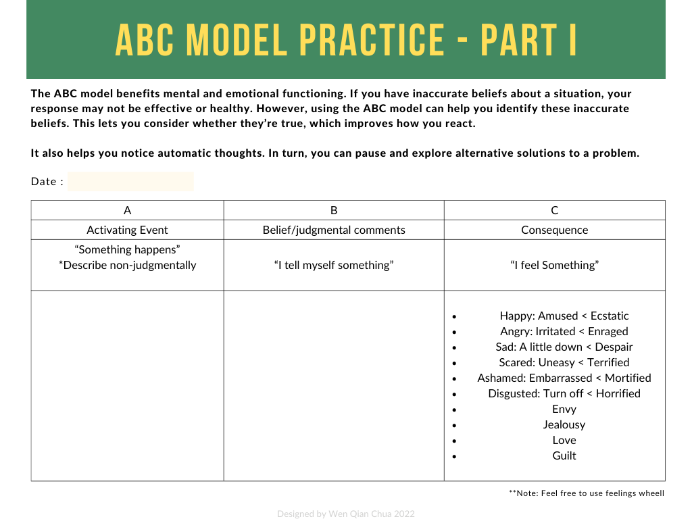
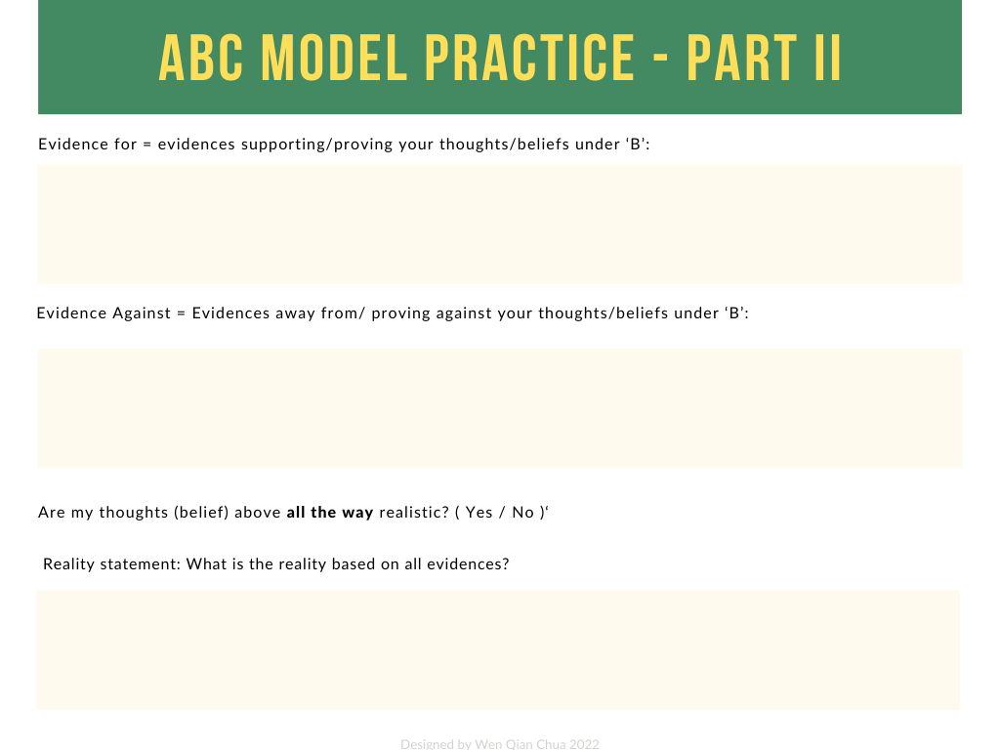
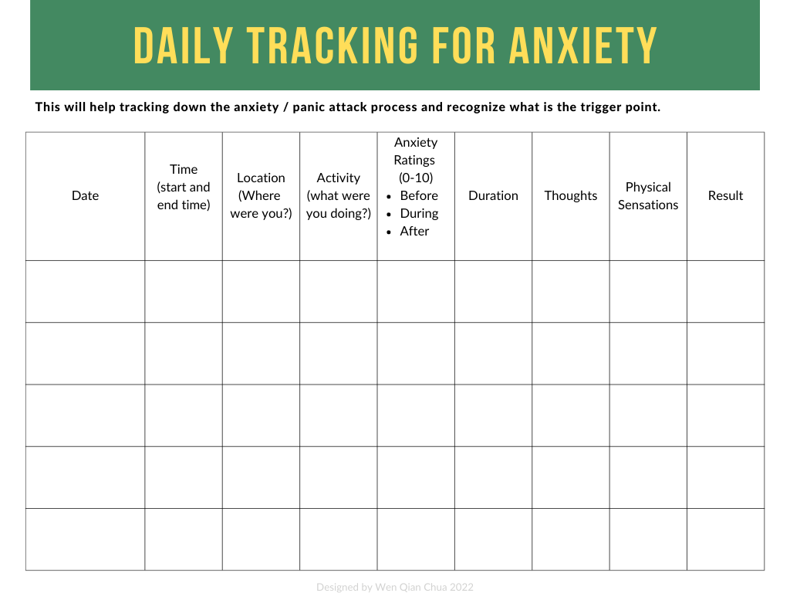
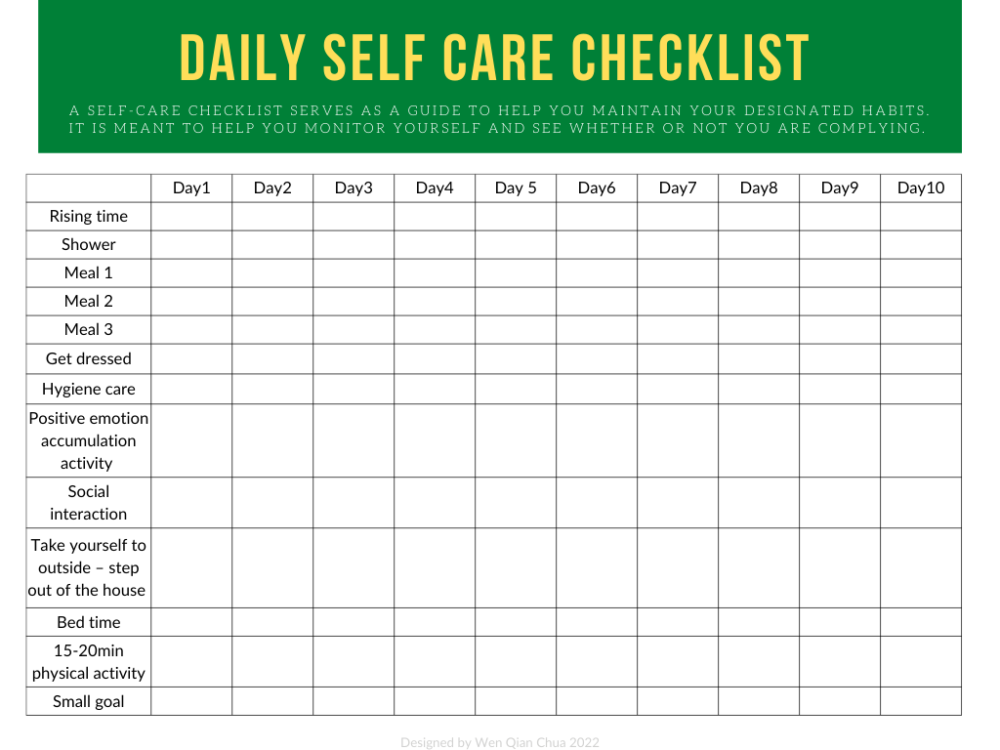

# Self-care Resources

>This will be some printable work sheets for people who might find it useful.

*Disclaimer: I am not a mental health professional, these resources are just something that I have collected over the years. For any serious issues please find a healthcare provider for professional advise.*

## Prevention and Crisis

Please find attached a downloadable PDF for the Virtual Hope Box. Feel free to follow the instructions in the PDF to build your very own hope box.

>Hope Box PDF
[download](../files/pdf/Self%20Care/Grief%20and%20Loss%20Coping.pdf)

## Maintainence

Here, you will find some printable PDF work sheets for maintainence exercises.

### ABC Cognitive Behavioral Therapy Work Sheet

>ABC Worksheet PDF
[download](../files/pdf/Self%20Care/ABC%20Model.pdf)

### Anxiety Tracking

>Anxiety Tracking PDF
[download](../files/pdf/Self%20Care/Anxiety.pdf)

### Self Care Check List

>Self Care PDF
[download](../files/pdf/Self%20Care/Self%20Care.pdf)

