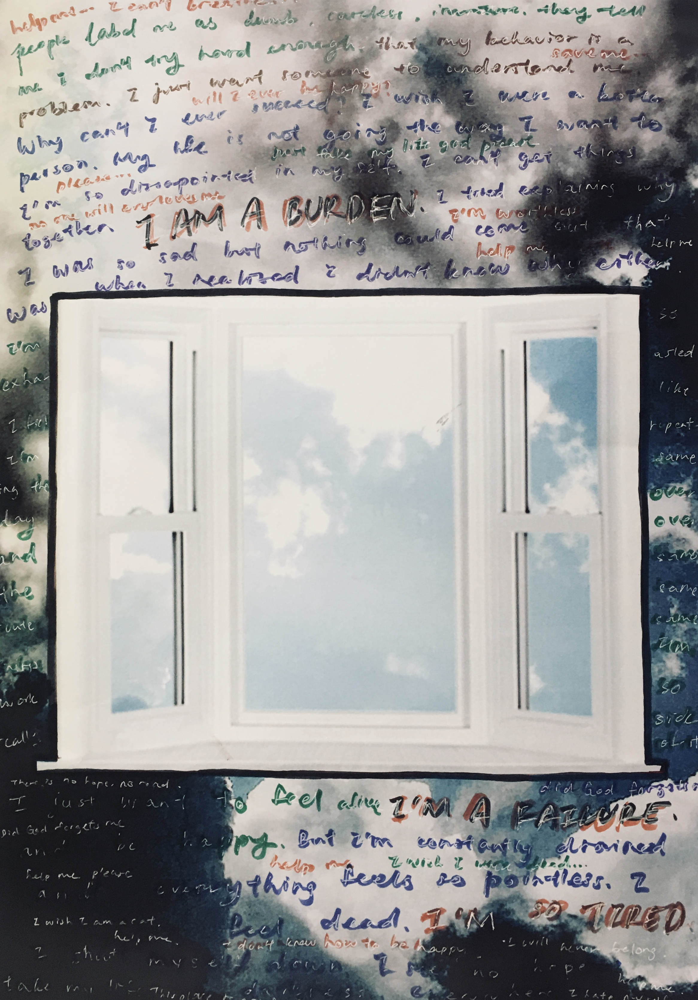
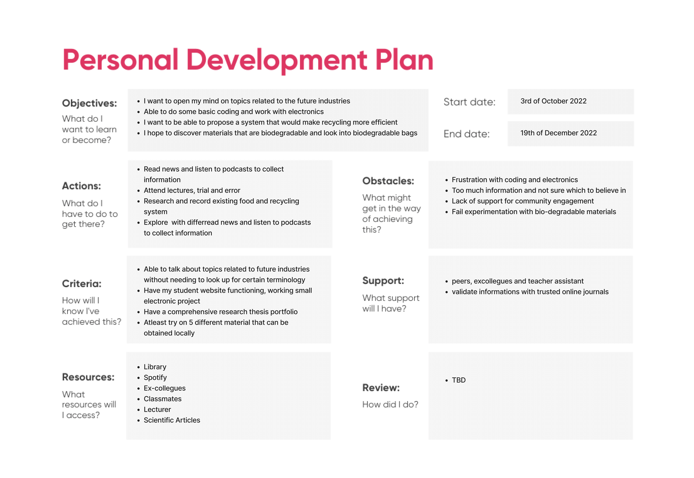
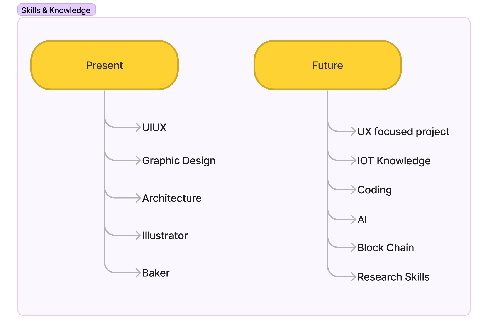
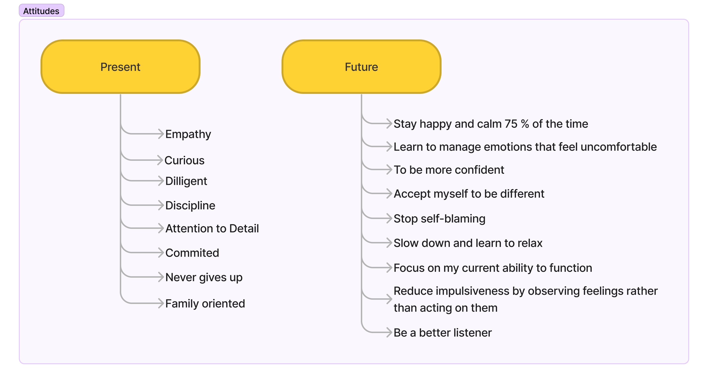
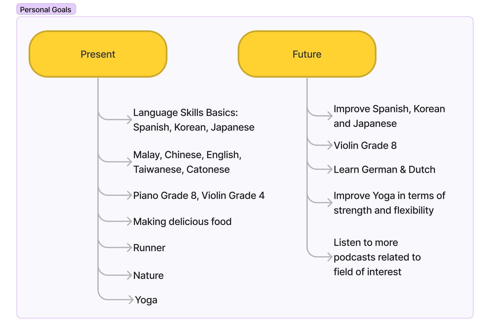
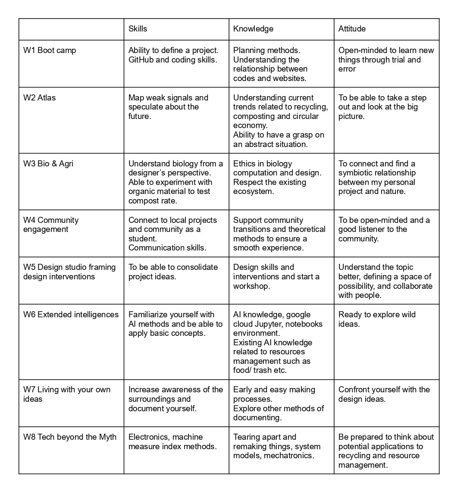

# Bootcamp

## Instructions

A. Upload your first post, name it “Bootcamp”.

It should contain: What's your fight?
Upload the poster you shared in class, explain it in a few paragraphs.

B. Vision, collaboration plan and personal development

Create your own personal development plan for the master (1st Trimester).
Create your design vision of how our (social) world could be in the (near) future
Describe your professional identity in terms of skills, knowledge, and attitude.
Reflect on the “meetings” by analyzing what attracts you from their skills, knowledge, and attitude
Based on your vision and what attracts you from the “meetings” create your desired professional identity
Map the courses we are having this trimester in terms of what you have learned (for the past ones), and what you would like to learn (ones to come).
Justify and describe your personal development plan for the master program.

## Part A

Something that I have always felt strongly about is issues related to mental health. 
Emotional pain from trauma or depression can be detrimental, yet it is not always being taken seriously. It’s important to recognize that early mental health symptoms are pointing towards a more serious illness. Many people ignore their symptoms as they are afraid to be stigmatized. Most of the time, we’re waiting for something terrible to happen, such as suicide, overdose, violent outburst, or heart attack before we take things seriously and do anything.

This picture shows what depression might look like for those who have never experienced it. Things that seem mundane to normal people can be very difficult for those who are suffering with mental illness. People with depression might find it difficult to see things as it is, for example: the sky, without being swallowed by their own thoughts, assumptions and thinking patterns. Mental illness is common, but care is lacking. The window serves as a reminder that things can get better. There is always hope no matter how bad the situation is. One day, people will heal from depression, and they can just look at the sky and see the sky as it is. There will be a day when they can just look back at their sufferings, and smile because they get through it. The battle against mental illness is a long fight, and it requires the right kind of treatment and the proactivity of the patient in order to heal effectively. 

I hope that mental health treatment and services will be more accessible and affordable. I think when we are talking about helping others and contributing to society, it is important to draw attention internally to ourselves first. This is because when you’re whole and healthy, then only you will have the capacity to help others and take care of the well-being of the surroundings.

## Part B

While my fight are issues related to mental health, I am also passionate about resource management and circular economy. With this in mind, I made this development plan for this trimester. I speculated some major issues that I might encounter through this process.

I hope to contribute by designing a product that aids the circular economy. Thus, I am interested in systematic design for effective resource management in each city. In the near future, most consumers will be consuming local produce and materials, and be able to recycle waste effectively.

During the meetings with Charlson, Ahmed, Myrtleo, Saher and Stella, it was encouraging to learn that everybody comes from a diverse background with several years of professional experiences, some of them share similar visions as I do. One of them have encouraged me to continue developing my projects on mental health related issues since it meant so much to me.

I suffered with trauma, depression, anxiety and personality disorder, thus I worried that I lost myself and get too personal in the process. While I am not entirely certain that my project will be related to mental health issues, I will be incorporating some mental health goals for myself for this part of the assignment.

I am a UIUX designer with an Architecture background. I was a teacher in an international school. Furthermore, I am also an illustrator that is planning on publishing children books, and a co-founder for a small home bakery start-up in Malaysia. These are the core skills and knowledge that I have professionally. Through this masters program, my prospective future plan is to build up my skill set and portfolio catering more towards a UX designer/researcher direction while getting a holistic view to the emergent future industries.

Generally, based on my experience, I am confident that as long as I put my mind into something, I would be able to achieve it. What pulls me back from success and happiness are the words that I tell myself subconsciously and thoughts in my head. Thus, for the future desired attitude, I will be focusing on spiritual enlightenment, finding inner peace, and self acceptance.

I have included a personal goals section. These are collective things that I do that made me genuinely happy. These are also something that will help me to recharge and be a source of creativity when I am feeling down. Deep down, I just wanted to be happy and find a sense of purpose.

Overall, I will be working towards resource management, with an interest in food source, compost, and recycling within a city. I am open for changes and alterations, but this would be the roadmap that will guide me throughout the trimester. I also hope that while learning about all the new skills and knowledge, I will be able to build up my portfolio as a UX designer catering towards a more UX and research perspective. Last but not least, I hope that I can be emotionally stable, safe, happy and enjoy the process while exploring.

## PDF

[Bootcamp](../files/pdf/WenQianChua_MDEF2023_Bootcamp.pdf)
