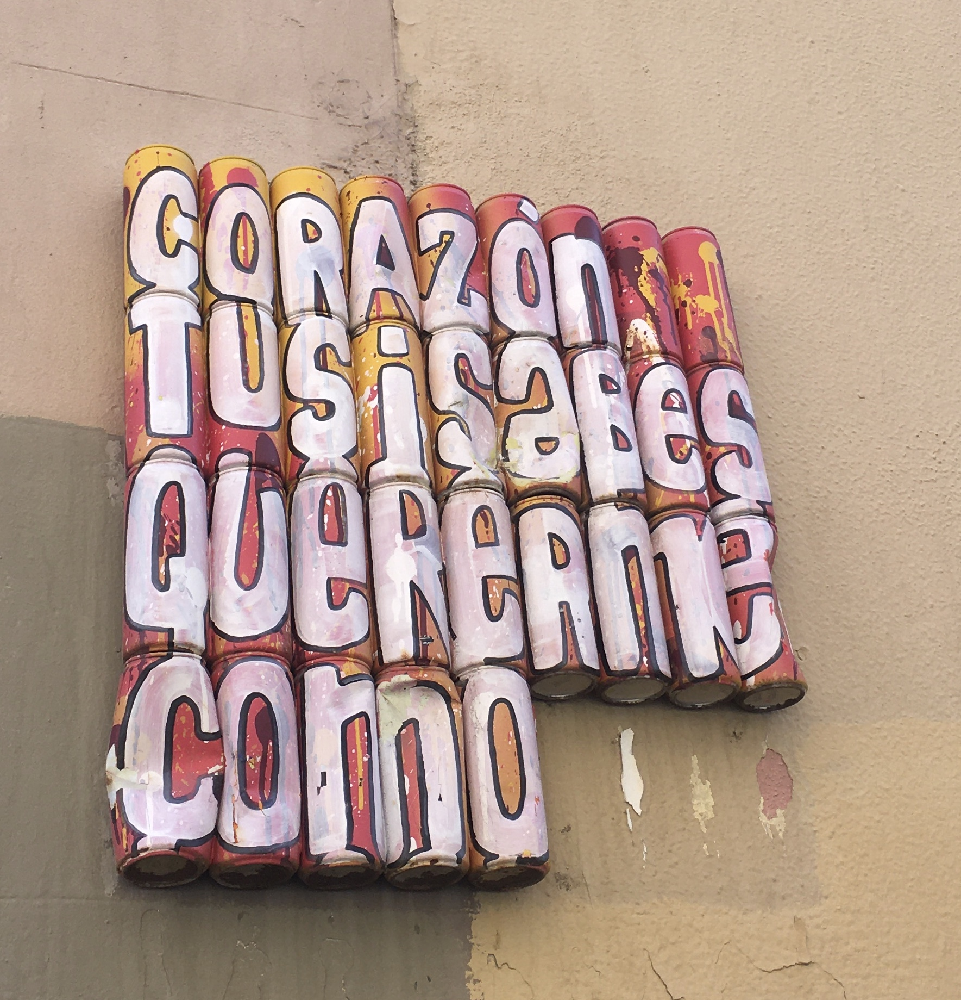

# Atlas of Weak Signals

## Instructions

A. Research and Prototyping

Reflect on your own RtD toolbox based on “your poster, your vision, and desired professional identity”. Reflect on the 4 different roles of prototyping by answering the following two questions. Which ones have you used and for what purposes? Which ones you haven’t used and how do you think could be interesting for you? Afterward, select the main roles of prototyping, combinations of them, and other design activities that you want to use. 

Create a “new workspace” where your present and desired RtD toolbox can be used. You need to map what you have available for your project (materials, infrastructure, things, and people) either here or in other places. 

B. Design Space and Weak Signal

Design Space: High-resolution screenshot or multiple screenshots of your Design Space if it's too large.
Text: A brief 500 Words (1 doc page) explaining the areas of interest you framed in the Design Space.This can be done with the following guidelines:

I. What are your main weak signals, and why did you choose them? Are they related to your fight? Do they represent areas of research you always wanted to explore but have never had the chance to? Are they related to your previous background and experience? How do you think they are relevant right now locally and globally? These are the kind of questions you can explore here.

II. What areas of opportunity do you think they can offer?

## Part A

My RtD toolbox will be a combination of Accumulative, Expansive, and Probing.
 
Based on my experience, when the research direction is clear and specific, I would use Accumulative. When I have a concept with a few ways to illustrate an idea, then Expansive would be my approach. Probing is a technique that I use when I am working with ambiguity. 
 
As a UIUX designer, the most common role of prototyping that I have been using is a prototype as an Experimental Component. I prepared low-fid and high-fid prototypes to carry out usability testing or showcase to see if it works. Most of the time multiple prototypes were prepared for a scenario to see which provides a better experience. One of the examples that I did during my work:
[UX Case Study](https://www.behance.net/gallery/141887389/UX-Case-Study-Design-Enhancement)
 
I had experience using prototypes as a Means of Inquiry through my previous project:
[Reimagining My Sejahtera](https://www.behance.net/gallery/123693987/Reimagining-My-Sejahtera)
This is a way for collecting data and seeing how humans interact with the design. My Sejahtera is a covid-19 tracking and appointment management app in Malaysia, my partner and I redesign the app based on a series of research and interviews. We launched the designs and sent the prototype to people around us. Then, we use the heatmap to visualize the user flow throughout the process. We learned about users’ pain points and struggles through interviewing them. In the end, the final product produced is a series of interventions based on the data we collected.
 
My experience of prototyping as a Research Archetype is when I had to make ‘space’ in architecture school through a kit of parts: wood, strings, and tapes. We end up using the materials to visualize the scale for different spatial situations and floor plans. It is helpful as we were able to bring our project to 1:1 scale, physically experience and experiment with it before putting our ideas into rendering software. Our temporal installation is also tangible, this means that we can easily change the experience with just a few touches. Besides that, I also had experience choosing materials and finishing from catalogs while I was doing architecture-related projects.
 
I have not experienced using prototyping as a Vehicle of Enquiry. This can be an opportunity for me to apply this method in my upcoming projects. Using prototyping as a tool to document and analyze the process sounds interesting to me. I have never tried this method, so I might apply this on my future design product. It would be interesting to see how I can craft a digital or physical product through this method of prototyping, as normally I am inclined to use prototyping as a test of hypothesis or an open ended exploration due to my job nature. I also think this way of prototyping is very liberal, as the results will not be limited by a preconceived notion or a specific group of people.
 
Since I have quite some experiences with the different roles of prototyping, I would like to  start with using prototyping as a Vehicle of Enquiry, the one that I experienced the least so that I can equip myself with this skill set. It seems to me that Probing might be a good pairing with this role of prototyping. With this in mind, I will set this pair as a general direction when executing my upcoming design project. At the same time, I will keep an open mind to include other RtD tools and roles of prototyping whenever it is necessary should the scenario change.

## Part B
 
For this part of the assignment, I will be focusing on networking, resources and people that I have as I think they are the most crucial part to complete my future design intervention.

**My Work Space**
 

**My Design Space**

I have always been interested in issues related to mental health ever since having personally experienced chronic depression and anxiety. It was a really painful process and I wish that nobody will ever have to experience it. This is because when you are trapped in your own heart and mind, there is no place for you to escape, it is like a living hell. It is absurd that while there is so much air, you still get out of breath, spending hours and hours laying awake. I guess that’s the reason why some individuals might choose to end things and give up on their lives. 

My grandfather’s generation suffered from poverty and my father was able to change the fate of his entire family with seven other siblings through higher education. Therefore, from a young age, I grew up believing that education is the key to escape poverty, and the thought of ‘I have to be a professional to survive and make a living’ was planted inside my head.

Therefore, I went to architecture school and tried my best to get all the required skill sets in order to get a job as a professional. As I switched my career path and became an UIUX designer, I noticed that I would still develop side projects related to mental health. I write and illustrate short stories that are heartwarming for adults, posting them on instagram, and have been running a website for two years. 

Although my drive for issues related to mental health is always there, somehow I could not find a connection and opportunity for me to connect it with my career. I tried to make a living with this passion, but it did not work out for me. It seems like the only way to do it is to be a counselor or therapist. This results that even though I am doing very well as a UIUX designer in my previous company, I am always looking forward to the time outside of my work to do things that I like. Since I am spending 40 hours (or more) per week working, I felt very lost and numb during working hours. Some might argue that being able to have existential crises is a luxury, because we have all our human’s basic needs to survive, such as food, shelter and safety. Yet, we still suffer, just on a different spectrum. I think it is an opportunity for all of us to question ourselves, raising our consciousness to another level to attain a greater level of peace and happiness.

When I started with the bootcamp poster assignment, subconsciously I still believed that my drive towards mental health is ‘useless’. I felt anxious when I was the only person shouting that drove out loud. At that moment, I was not able to picture myself pursuing a project related to it. Thus naturally, when crafting my personal development plan, I draw my attention to another issue that interests me: recycling and resource management. Also, recycling and resource management feels assuring to myself as there is a vision and direction for me to develop the project.

When I could not find anything related to mental health in the physical card deck, there was a small reassuring voice in my head saying that it is right to just focus on recycling and resource management, and forget about issues related to mental health. It is more relevant to the future, and all the pressing crises that we are experiencing as a global citizen. Afterall, mental health related issues are too personal and delicate, and it is hard to see the profoundness of it in relation to the climate crisis. In terms of scale of impact, the climate crisis concerns the survival of the entire earth's citizens, yet mental health seems like a personal issue to me as not everyone suffers drastically from it.

Things started to change after a conversation that I had with Mariana. As she suggested, I looked at the Miro board with the new digital card decks that were added. I noticed that most of the new cards that I have chosen have more connection to mental health and spiritual awakeness. My gut feeling is telling me that I should just follow my heart. Afterall, climate change and mental health are connected. There are studies that show mental health impact on climate change. It was an epiphany moment for me, as I realized that when there is a climate crisis or pandemic, mental health support will be equally important. **While people die from drought, tsunami, covid-19, earthquakes, heatwave and so on; but remember this, people die from depression too.**

So I went on and develop my design space with a few area of opportunities in mind with my main weak signal, Climate Conscience. My area of opportunities includes Ideation and Design Centric research, Design for Social Innovation, AI and Machine Learning and Maker Education. I am looking for a way to make mental health support more accessible and effective for those who are in need, specifically on prevention and recovery. This will open up more research directions such as what causes depression, healing transgenerational trauma, the role of the subconscious mind in depression etc.

The first idea that I have is the notion of a ‘Crisis Box’. The ‘Crisis Box’ concept arises from one of my therapy sessions. Individuals that are suicidal are advised to create a crisis plan. This normally consists of a pen and a paper, some questionnaire, and the process involves jotting things down, writing emergency contacts and preventive plans. Personally I find this process tiring and dreadful, especially for somebody who failed to see the purpose of living. I divided the ‘Crisis Box’ concept for different stages. In the early stage, I will source recyclable materials and try to prototype a ‘Crisis Box’. I would need to do some research on what goes into the crisis box. At this stage, the ‘Crisis Box’ will be catered for depressed and suicidal individuals. Then, if this version of the prototype works, I can create a laser-cut friendly template so that this can be scalable and has the potential of becoming a community maker’s project. For this stage, I will start exploring the potential of ‘Crisis Box’ for non-depressed individuals as a preventive measure. This will also open up another possibility of preparing a ‘Crisis Box’ as a gift for someone you love. Afterall, everyone has ups and downs in their life. It would be nice that there is a prevention plan or things to do when we are grieving. As a community, we are not taught to handle grief and sadness properly, that might be the reason why some would resort to alcohol, substance abuse and other activities that are a health detriment. If this version works, I am hoping to collaborate with local therapists to utilize this ‘Crisis Box’ in the therapy session to see if this prototype can be useful in practice. In the event of a climate crisis, I wonder if there is an opportunity to make the ‘Crisis Box’ a handy kit that can accommodate different mental health needs. I would also like to explore possibilities to use AI and Machine Learning, incorporating the ‘Crisis Box’ idea into a digital product. I hope to study the role of AI in detecting depression, and coming out with a customizable preventive or recovery plan for future iterations.

The second idea that I have is using art and illustration in healing depression. Pictures and art are a form of non verbal communication, there are studies that indicate picture books can improve mental health. It is a way for using pictures to communicate directly to our subconscious mind. One way of doing this is using picture books and children’s stories as a means to illustrate values and concepts in therapy sessions. I am very interested to see if it would make it easier for the patients to take in concepts and values. I am still developing my ideas on this, as this is a side project that I have been working on for years. I tried to contact some publishers in the past, however the most frequent answer that I get is that most picture books are for children, there is no market for adult picture books. In spite of that, I will be visiting the Frankfurt Buchmesse 2022 this coming weekend. I still have no idea what I might do, but I will be meeting an experienced Malaysian illustrator that has published many children’s books, and I can use the booth if I want to when I am there. Perhaps talking to her would help to develop my thought processes. Aside from that, another way of using art and illustration in healing depression that I can think of is through creating art therapy or expressive therapy workshops with the community. When people gather together and carry out activities, it will be an opportunity for them to establish ties,  creating a safe space for emotional assurance.

With my UIUX background, I hope to relate or create a digital product, so that it can benefit people that suffer with mental health issues on a larger scale. As a designer, I hope that I can contribute my knowledge and skill sets working with psychiatrists and counselors so that the therapy process can be accessible and effective, healing and preventing depression can be easier than it has ever been before.

## PDF

[AoWS](../files/pdf/WenQianChua_MDEF2023_Bootcamp.pdf)