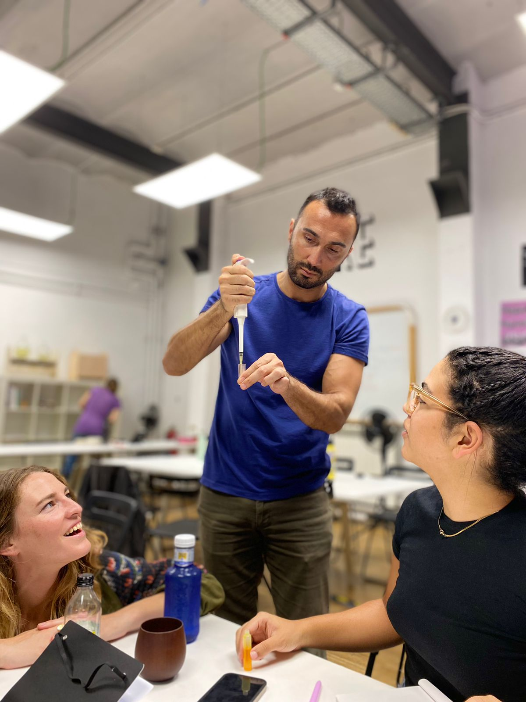

# Bio & Agri Zero

## Instructions
*I. Post two pictures of the seminar.*

*II. Choose an article, discuss the article from a personal perspective by referencing some scientific papers on the topic.*

## Bio Plastic Experiment

## Group Work

## Article

The article that I have chosen is called **Unboxing Mental Health**. 

[Article Link](https://aeon.co/essays/common-mental-processes-often-underlie-different-diagnoses)

It argues that the current mental health diagnosing system is not efficient. This is because it is inappropriate to classify collective mundane experiences into convenient diagnostic categories. Furthermore, there is often stigmatization associating to certain diagnostic labels such as some personality disorders, which was associated more on the personality of the person rather than early childhood trauma or experiences. While the author argues that the transdiagnostic model might be a pleasurable alternative, there is still work that needs to be done before deciding this would be the solution and future for psychotherapy treatments.

First, what is a transdiagnostic model? A transdiagnostic perspective is through discovering the common ‘processes’ and ‘mechanisms’ across different psychological disorders, you will have a universal shared approach in treating them. This is a process to predict a generalized factor which may be the root cause of psychological disorder. The process may include attention focus/ bias, pervasive beliefs, distress intolerance, worry or preoccupation and so on.

Video Reference: 

[What is the Transdiagnostic Approach to Mental Health?](https://www.youtube.com/watch?v=v8fN8dfx99Q)

[Transdiagnostic Psychological Interventions: Why Do It Any Other Way?](https://www.youtube.com/watch?v=U2TLepJ_sLg)

The article spoke to me as I had experience in being diagnosed with a personality disorder and the process feels unreal to me. I remember back then I filled in an 8 question quiz in less than 10 minutes after talking to the psychiatrist. After seeing the results, I was labeled ‘mild’ with that particular personality disorder. Then there are certain treatments methods including medications and plans which sounds a lot like normal advice that anyone would give to those who are in pain. It makes me ponder: just because I happen to be at my lowest point in my life at that moment and have traits that match to some checklist, then I was perceived as someone that is mentally ill, I become a ‘problem’. Will that thought necessarily help in recovering? Will the results come out differently  if I am in a good mood on that day? What are the standards to decide if a symptom is  ‘chronic’? My experience is not something new among the people who has personality disorder, as through this [research article](https://bpded.biomedcentral.com/articles/10.1186/s40479-020-00136-4), we can see that: “...the findings adds to the ongoing concern about the stigma, prejudice and poor provision of services for people with personality disorder. It states that consumers with personality disorder often do not receive an explanation of their diagnosis, or experience stigmatizing language and insufficient evidence-based information about their diagnosis.”

With that note, I agree that a transdiagnostic approach might be much more plausible rather than classifying patients into different categories of disorder. This will be a holistic approach, and removing biases and potential errors during diagnosis. According to this [article](https://psycnet.apa.org/fulltext/2020-10232-001.html), it supports the above statement: “overwhelming weight of evidence from decades of such data-driven efforts indicates that mental health problems are best conceptualized along a series of continua rather than as discrete categories.” 

Furthermore, according to Lisa Ekselius’s research on Personality disorder: a disease in disguise, the other common problem with the classification system is that persons with personality disorders are known to be under-treated with respect to physical health and are over-represented in the group categorized as the ‘difficult patient’.

There are initiative to make a shift focusing on the commonalities between different personality disorders, according to this [article](https://www.ncbi.nlm.nih.gov/pmc/articles/PMC6327594/): “There is a clinical shift from an earlier focus on the characteristics of discrete personality disorder entities to an awareness of the common features of different personality disorder, the suffering of patients, and the many problems they face in interpersonal relationships and daily life.”

However, wIth all the positive points mentioned, there might still  be some controversials on the effectiveness of a transdiagnostic approach for certain illnesses such as PTSD. According to this [article](https://www.ncbi.nlm.nih.gov/pmc/articles/PMC5582803/): “There is no published empirical data comparing a transdiagnostic approach to single-diagnosis protocols for PTSD…trials are needed to understand the effectiveness of transdiagnostic models as well as the comparative effectiveness of transdiagnostic and symptom-focused treatment.”

While it is undeniable that there are key challenges that we might encounter while adopting this practice, however, it would still be an improvement from the current classifying system. From all the data that I collected, I therefore conclude that the points where the original article mentioned that transdiagnostic models might be a pleasurable alternative are accurate. 

