# Living With Your Own Ideas

## Instructions
*I. Begin your presentation with a brief explanation of the context of your exploration.*

*II. Try to answer some of these questions:*

*What did you make? And why did it matter?What happens when you involve yourself?What happens when you use yourself as an instrument? Did anything change about your way of working? What does it mean for your future work? After seeing the videos of your design space collective, how does it change your understanding of it, present new opportunities or inspire new possibilities for collaboration?*

## Part I

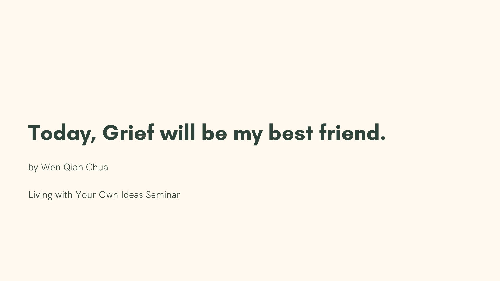

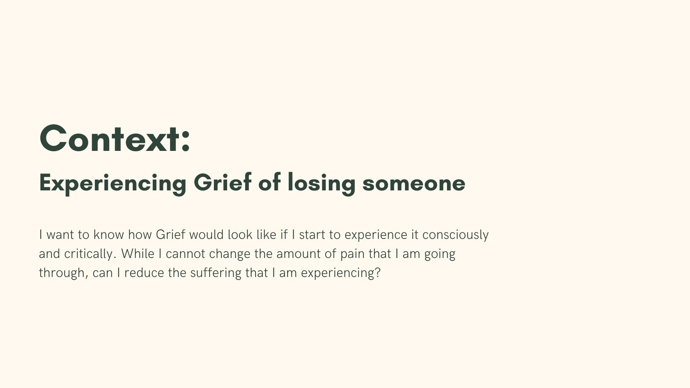

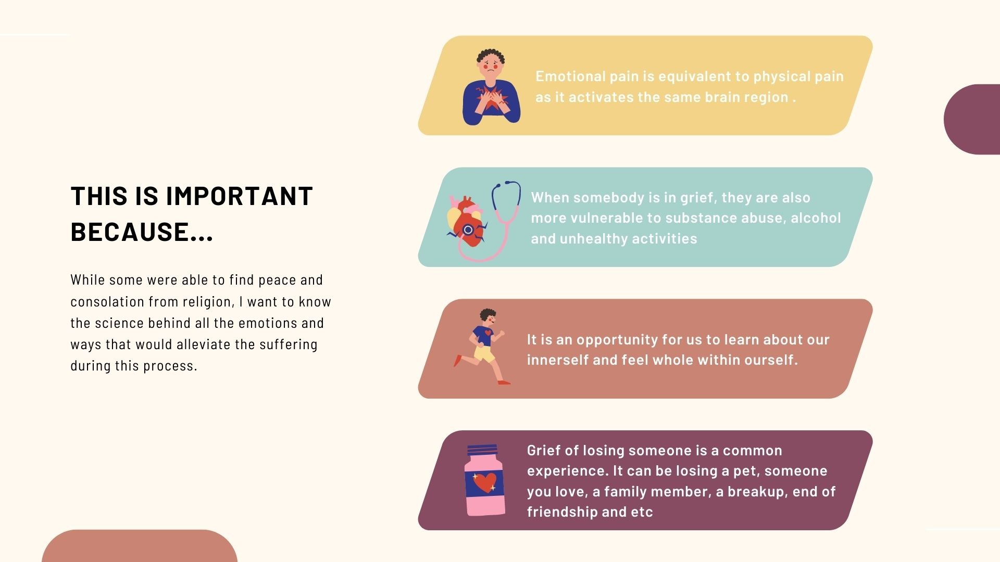

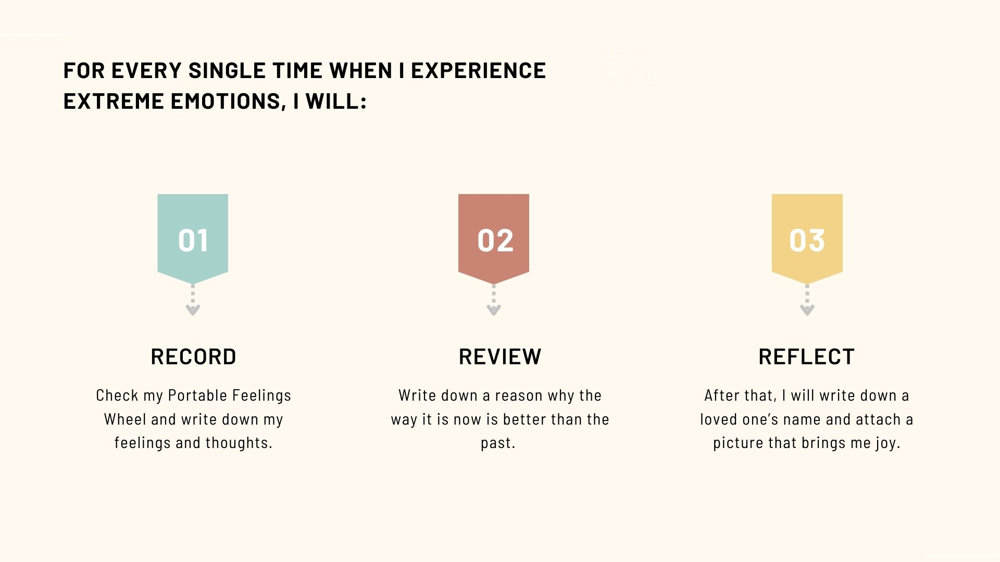

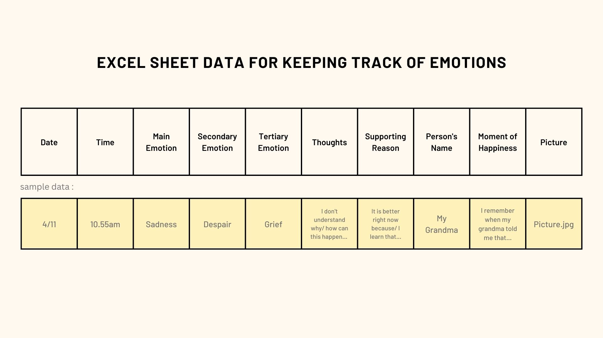

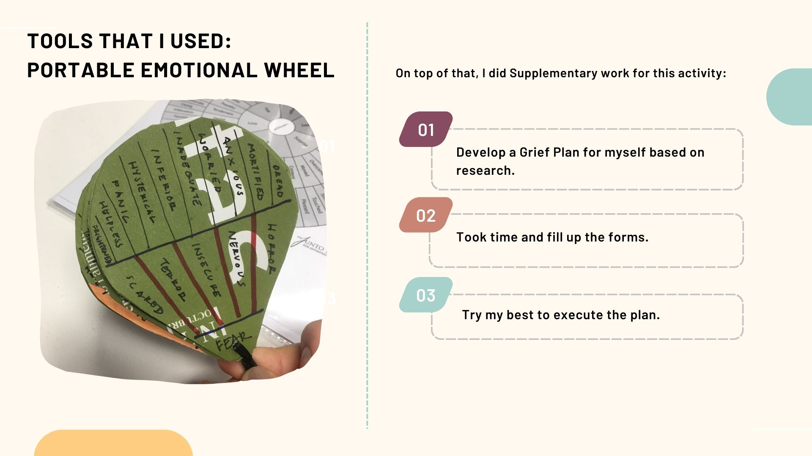

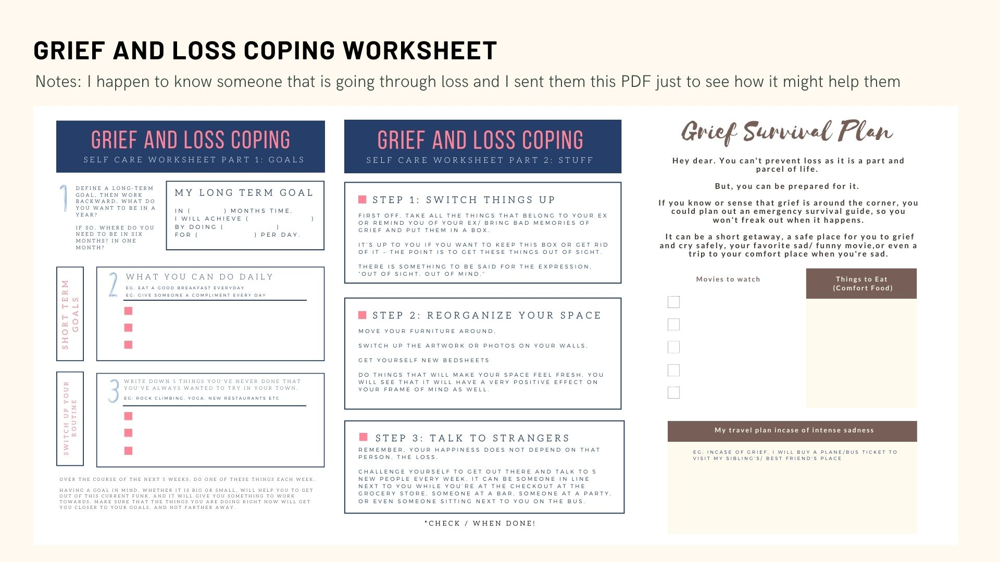

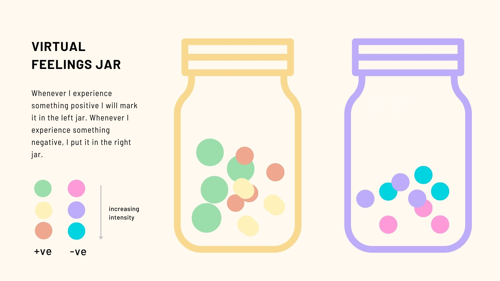

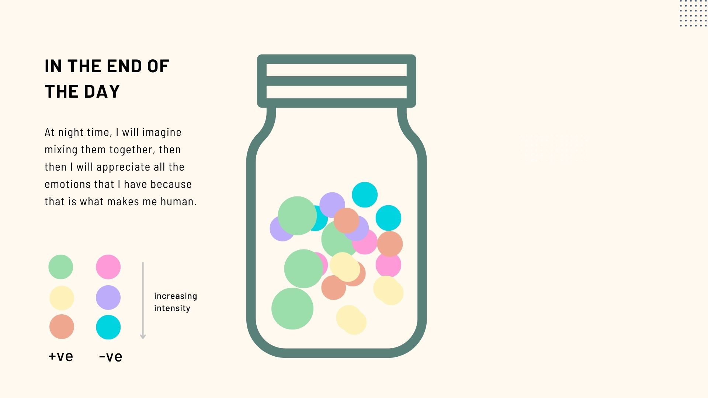

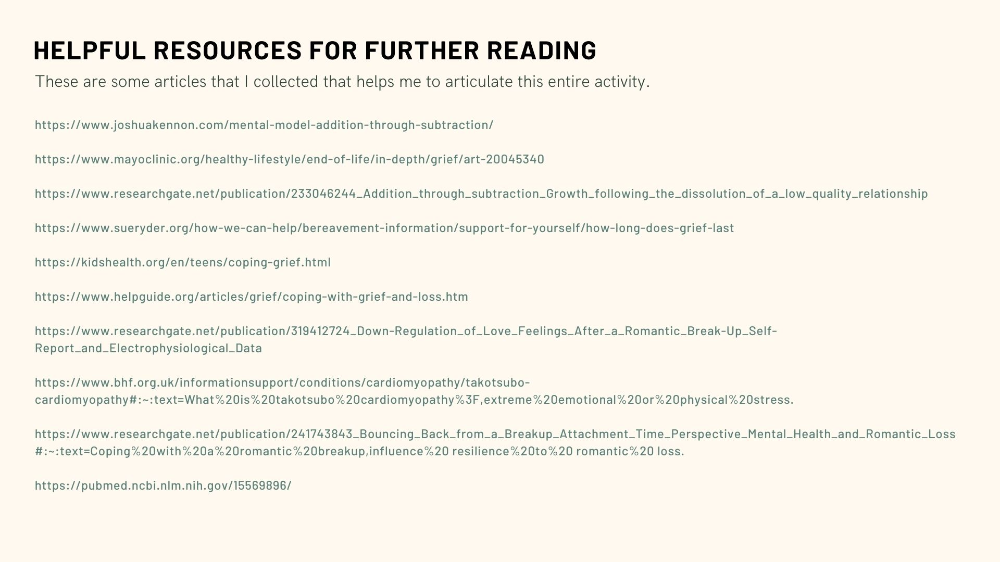

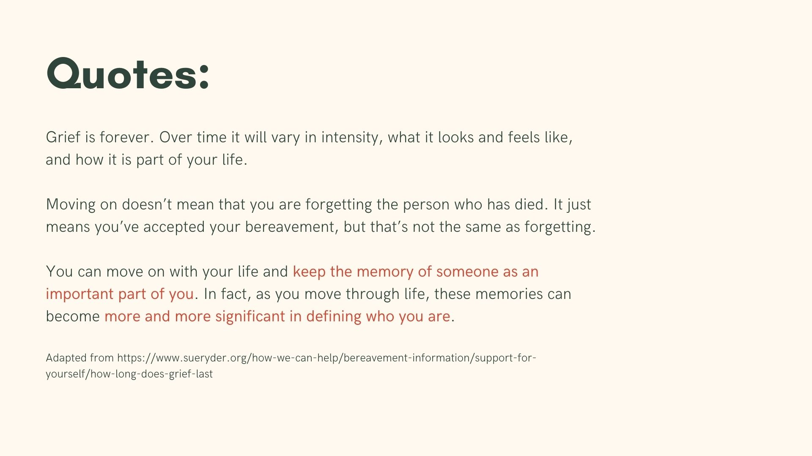

## Part II

I made a Grief and loss coping plan after studying some resources online. I also make use of my companion: The Portable Emotion Wheel to record my feelings and thoughts. Also, I designed a visualization tool for recording emotions.

When I involve myself, I experience my designs from a first person perspective.This is a way of eliminating biases when designing the system. As a designer, there is a tendency to make assumptions when designing for the unknown. 

For example, in my plan, the ideal user process is that for each moment when a sad scenario arises, the user will be listing down one person whom they love. In reality after trying this process myself, I noticed that the user would list down a few more person that they love instead of just one. With this observation, I might rework the process if I were to redesign this grief coping method.

For example, I will have the user that tracks their emotions to first list out whom their loved ones are prior recording their feelings. Also, while carrying out the experiment, I wonder instead of diverting attention to somebody else that you love, is it alright to recognize the fact that the person who caused you pain is actually the same person that can also bring you joy? This opens up another new perspective: using gratefulness to conquer grief of loss. If this is the case, who would be the target user? Will there be a user group that is not ready to thank the person that caused them pain, if so, what will the process look like to adapt to users with different coping capacities?

In my future work, I will consider taking in more data from affected individuals to avoid falling into the stigma of designing for people, and try to design with people. Also, I would explore new methods and possibilities so that my design can benefit more individuals, applicable in various scenario at a wider scale. This project is particularly challenging as it is out of my comfort zone and I am using myself as a subject of experiment. Nevertheless, it is a very rewarding process.

After seeing all the videos of my design space collective, I  noticed that some of us shares a similar interest. I would be interested to start new conversations and explore these topics together.
Besides, I would be interested to create alternative methods of tracking emotions. By doing so, I hope that this would help therapist to maximize the efficiency of the therapy process, helping people to heal from mental health issues. In short, through this project, I hope that this would be a starting point contributing to the notion of an 'emotional first aid kit', then hopefully in the end I can potentially build this idea into part of the the ‘crisis box’ .

