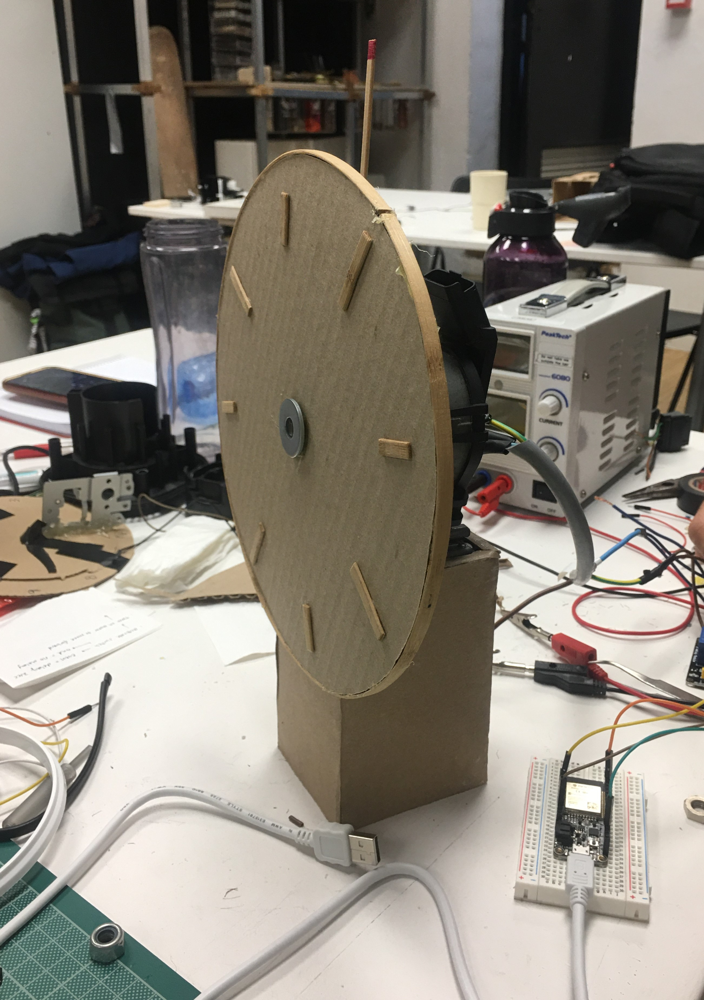
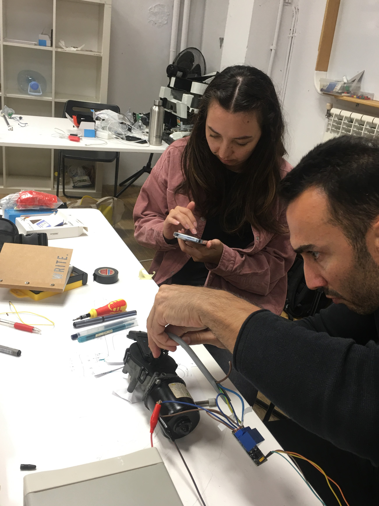
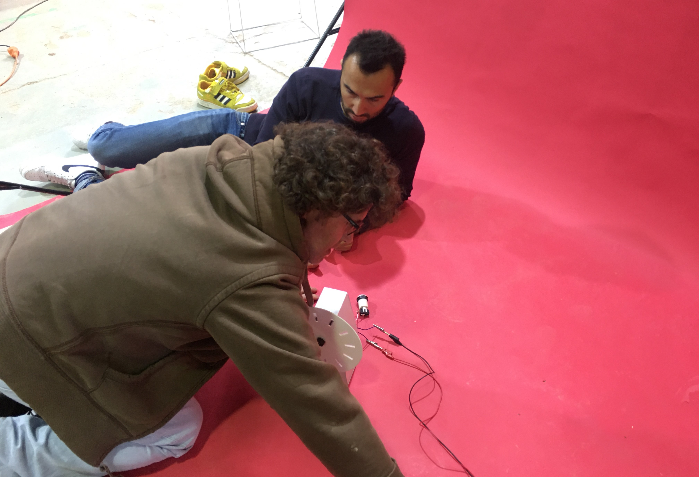
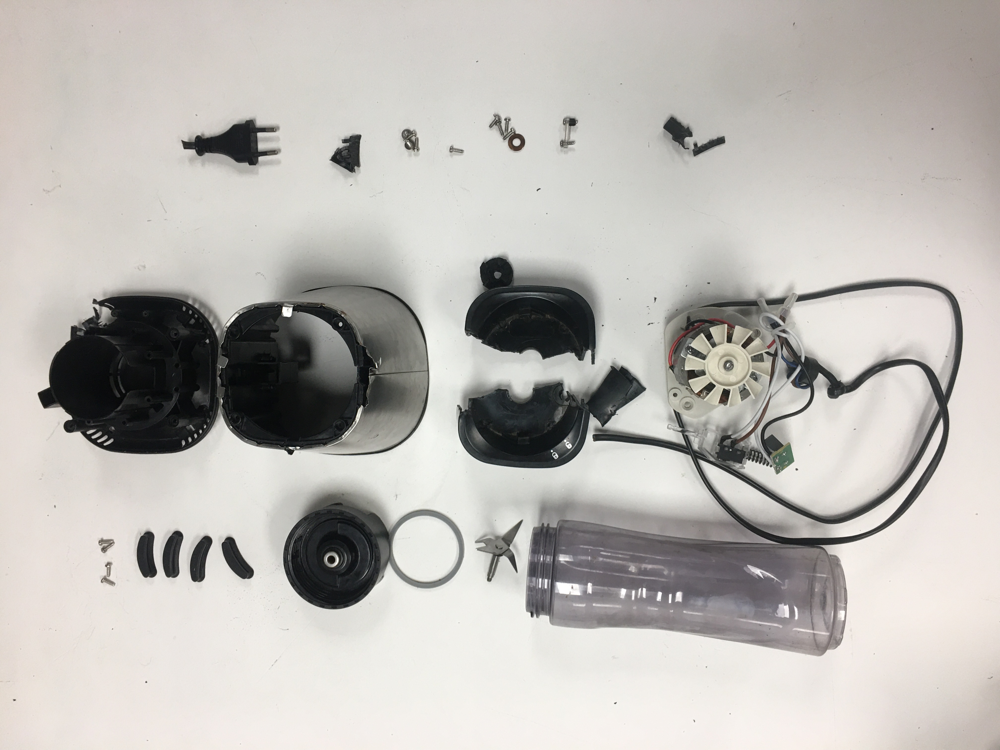
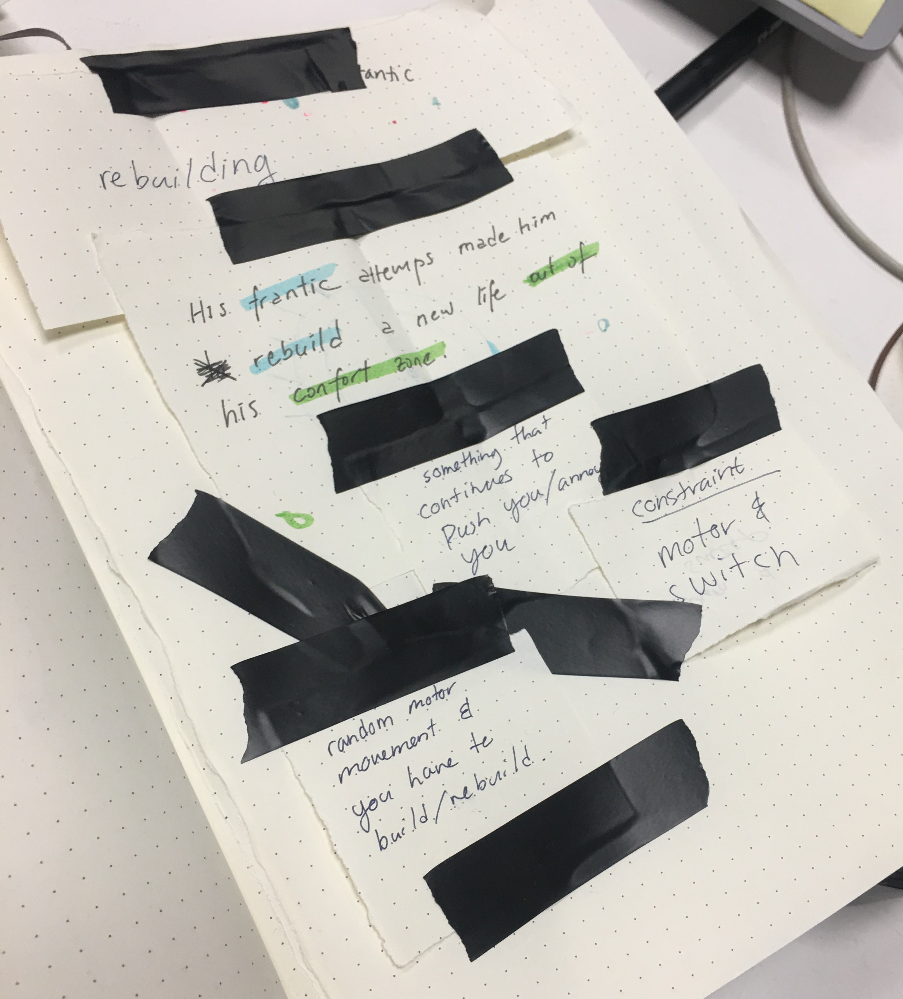
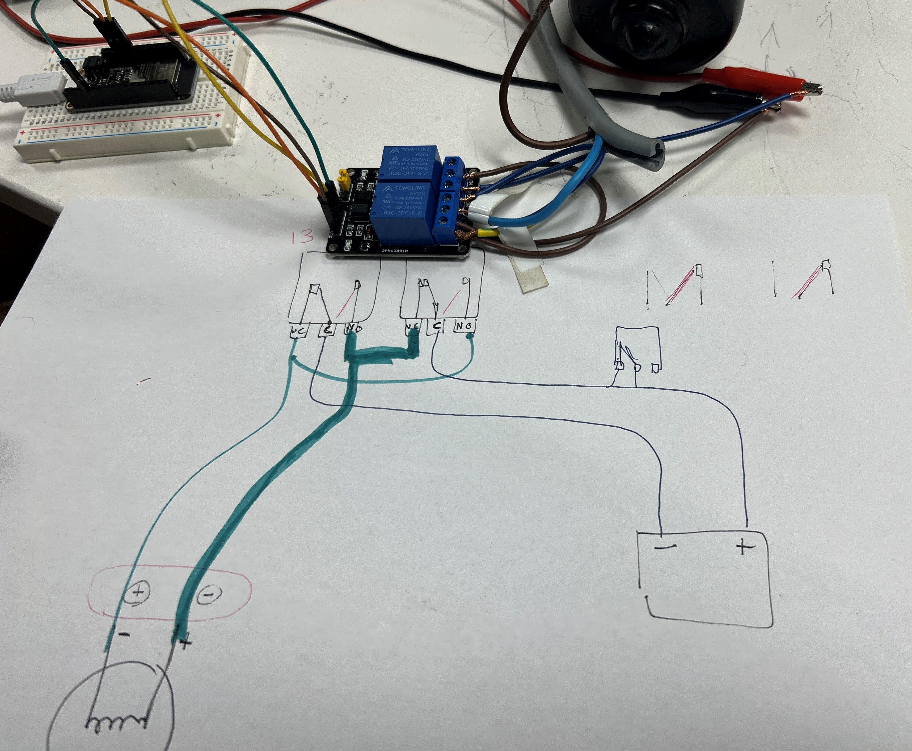
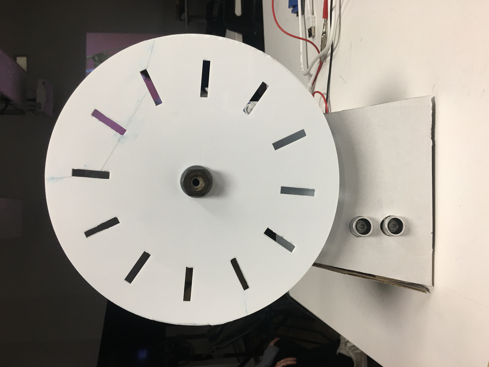

# Tech Beyond The Myth

## Instructions

*Write a post of your weekly experience, deliver the forensic report completely filled, reflect your learning goals and possible applications of the technology learned and add link to the exploration tools and files you produced and used in your repo.*

## Reflections

>These two weeks have been an eye-opening experience to me, as normally when something is broken in our household, my first instinct would be passing it to my father, my brother or my sister. 

They are the engineers in our house. Occasionally I see them taking things and electronics apart, but for some reason, I was never interested enough to stay and observe what they were doing.

This time, I have no choice but to take a blender apart. I am impressed that I am not as intimidated as I thought I would be. This experience changed me subtly, as I took apart a little device that I have with me that was ‘broken’ for ages after this. It is a [pocket angel](https://shoppocketangel.com/)–a modern personal safety alarm that will create a distraction during an attack. The alarm does not work anymore, so when I took it apart, I tried to inspect what was wrong with it. Then, I replaced the batteries and it worked again. As it is designed with planned obsolescence, it is not really user friendly for people to replace the battery. In the future, if my father, brother or my sister is around, I might still pass the broken electronics to them. Now, it will be slightly different. I will stay and perhaps offer some insights and help.

>During group work, I had the opportunity to learn communication skills in a cross-functional team. 

As a designer and a maker, I find it difficult to communicate ideas with a practical and realistic mindset when there is undue confidence in the finalized product. It was a struggle to explain and convince people coming from different backgrounds that things might not work as expected due to the constraints of the materials and resources. It was really hard to move forward when most of the time was spent discussing trivial subjects. Nevertheless, I am grateful for this opportunity to learn, as the instructors and my team members have been very understanding and helpful.

Behind the Scenes of trying to take a video of our 'Distracted Timer'. Fun fact: it fell apart and we spend so much time trying to fix it. 

Also, one thing that I noticed about my work style is I tend to be more submissive when it comes to decision-making. Even though I have the experience and the background to stand firm on my decision, I did not voice out. When my thoughts were validated in the end, this has already cost a lot of unnecessary work and resource wastage. This is also something that my manager noted about me during my previous work there as a UIUX designer. 

>In the future, I think there might be an opportunity to incorporate technology that I learned in mental health projects.

When I was working as a Design & Technology instructor in a high school, there were DIY projects where students craft involving Arduino. Thus, I could make my ‘Crisis / Hope Box’ idea more engaging by programming it with Arduino. There can be a display board that shows encouraging messages, a buzzer that goes off or makes music when somebody might be in distress, and so on. Potentially, there can also be a panic button where when it is pressed, it will automatically contact 3 important people that were pre-set. I will keep these ideas in mind and see how they will evolve as time goes by.

## Forensic Report

For the first exercise, we took apart a blender by Electrolux.

[Full Report](https://hackmd.io/s/HJBEvhPBo.JPG)

## The Almost Useful Project

For the second project, we created a 'Distracted Timer'. We started with an ideation process.

We also used diagrams to help visualize the entire process flow.

Our final product after iterations.

[Presentation](https://www.canva.com/design/DAFSGssYzEA/FqJPNQMS33QH5i-fKP5DVg/view?utm_content=DAFSGssYzEA&utm_campaign=designshare&utm_medium=link&utm_source=publishsharelink)

## Course Website

[Full Course Website](https://hackmd.io/QpMIMeepTIqulsaa-o7GAw?view#MDEF-Unpacking-Intelligent-Machines-2223)

