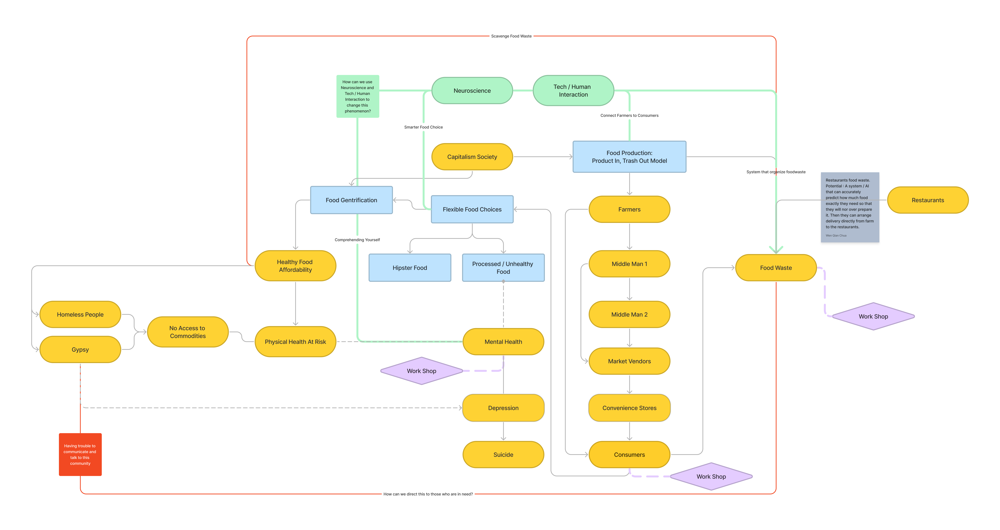
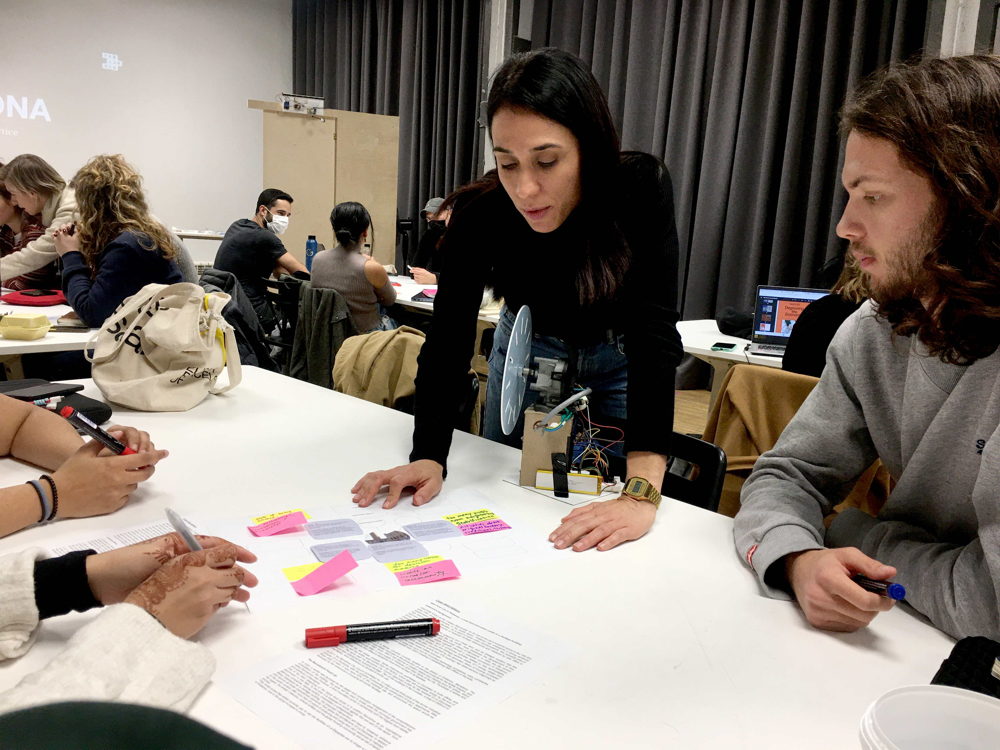
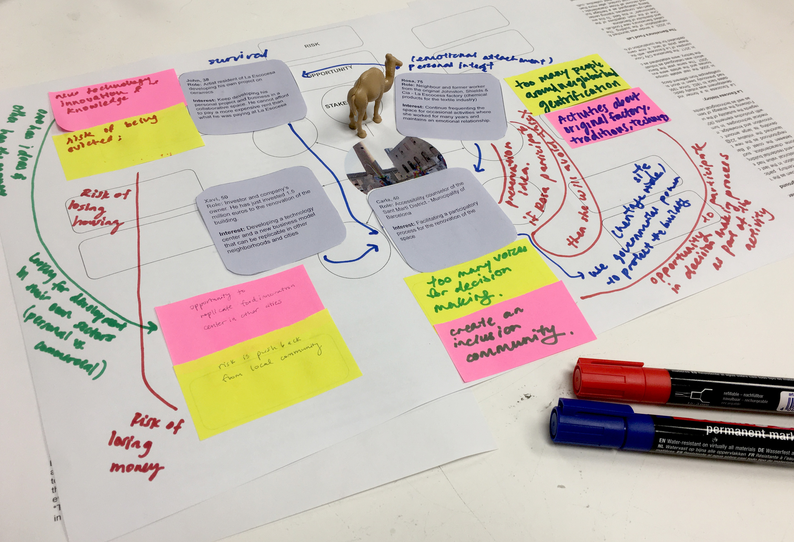
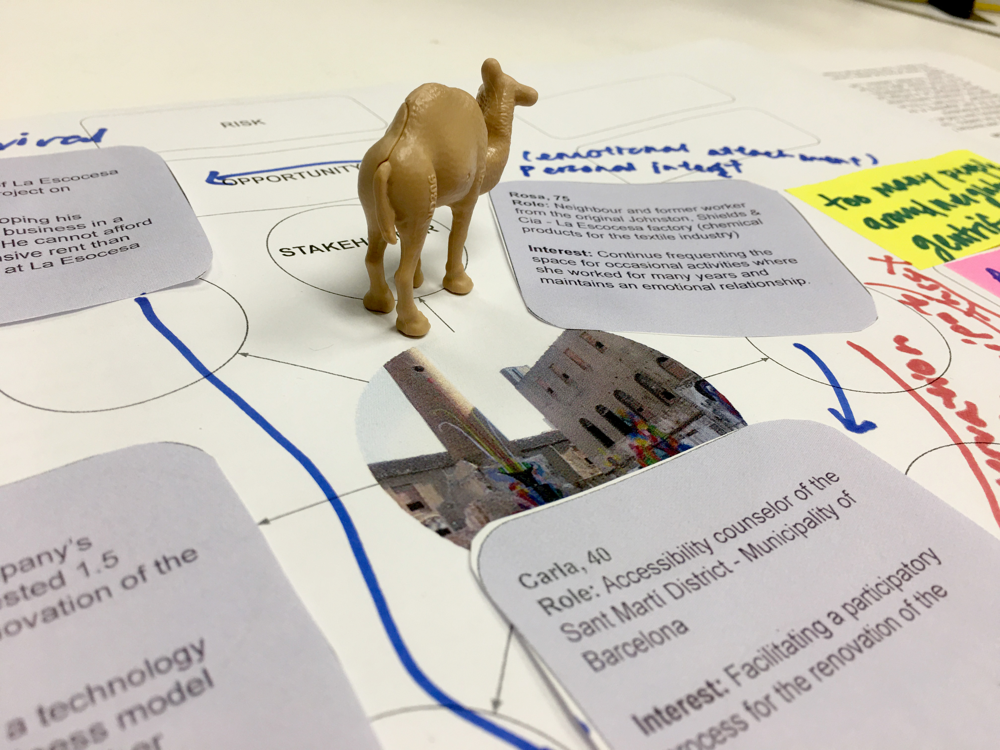
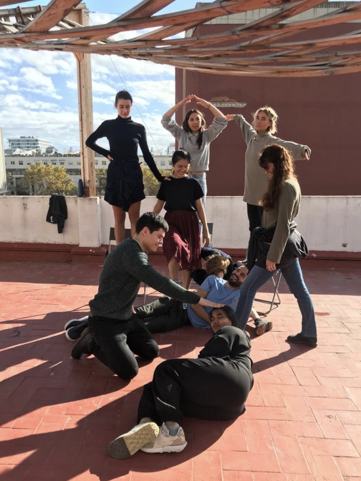
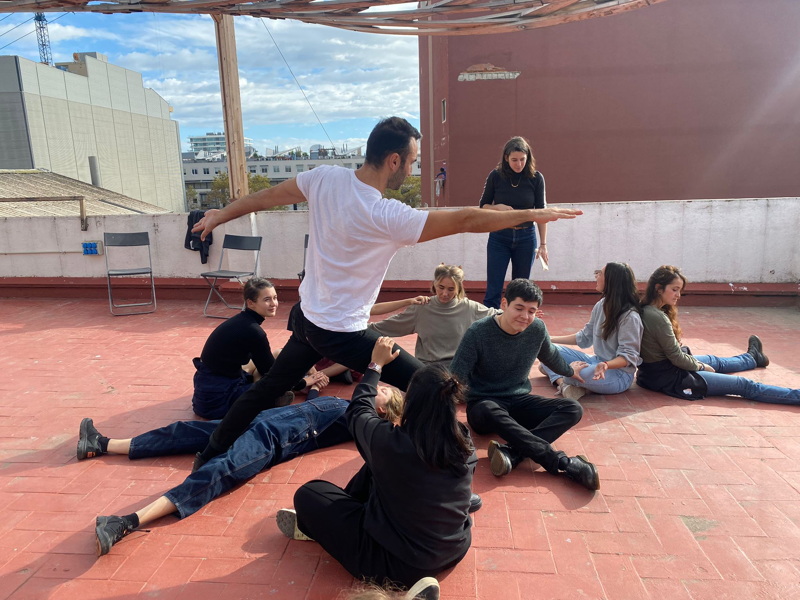

# Community Engagement

## Instructions

*Write a post of your reflection and submit the deliverables on this week's seminar.*

## Conflict and Relations Mapping

I created a map with potential ideas. Collectively as a group (Sami, Ramiro, Cagsun, Antonio and I) we are interested in mental health, neuroscience, human interaction with tech and data, human habits and commodities. I am curious on how these points might potentially converge.

The map shows all the areas of interest in context relating to the potential touchpoint with local communities.

##  Mapping the Local Ecosystem

For this part of the course, we were engaged in a role play to imagine how we can engage in community practice in the shoes of the stakeholders. As a group, it is an interesting experience as it helps to shift focus and perceive the project in other’s perspective. This method would help me to negotiate and communicate with the stakeholders better, since then we can foresee what might be the point of interest for the related parties.

##  Group Work Card Deck

>This was the card that I have chosen from the group work card deck. I would like to remind myself to apply this method in my upcoming design projects. 

I have chosen the card ‘Seeing the Forest, Seeing the Tree’ as it reminds me to perceive the bigger picture in any situation. Also, this shows that the any data collected can be used in many ways, and to know how to use it (whether to look at the summary of the data or individual choices) requires wisdom and experience. This also reminds me of a chinese quote: “当别人看见树木的时候，你要看见整片森林；当别人看见光点的时候，你要看见一颗星星”. It means that when somebody saw a tree, you have to be able to see the whole forest; when somebody sees a light, you have to know  that it is a star. On a wider perspective, I am reminded to take a step back when accessing a situation because sometimes the closer you look, the less you see. Only when you are distancing yourself without involving personal emotions, then you are able to perceive the situation with reason without judgement.

[Group Work Card Deck Info](https://groupworksdeck.org/deck)

## Social Presencing Theory Workshop

>During this workshop, we learned that sometimes we forget that we can retrieve a lot of information from our body and non verbal communication. 

In fact, our actions are actually part of our subconscious mind. As a class, we have embodied assemblages of both human and non-human actants for sensing underlying dynamics and locating opportunities for action. We use “higher educational system” as a general framework and intentionality.

It is interesting to see our 4D model as a cohort as each person might make a different choice. For my case, I was representing “government” in the system. Therefore, I might project my personal experience while representing the actant. 

Both models, before and after, seem like an accurate representation of what the current higher education system is and what the ‘ideal’ education system looks like. The model that represents the current system has a sense of hierarchy in it, and the ‘student’ in the system is at the bottom of the hierarchy. In contrast, in the new ‘ideal’ system, the ‘student’ , depicting a warrior pose, holds an active role in deciding the higher education system. 

## Envisioning My Intervention

In general, I am interested in creating or finding a community that is interested in mental health issues and shows willingness to heal. 

1. Potential participants:
- Friends and Family
- Yoga Community in Malaysia
- Seattle’s Community
- MDEF Colleagues
- Language Exchange community

2. Context

There’s an ancient Hindu story about the gods arguing over where they should keep the secret of happiness. Afraid that humans didn’t deserve or couldn’t handle this secret, they debated where to hide it. 

At first they considered putting it at the top of a high, high mountain, but reasoned that humans would eventually be able to find it. Likewise, they might find it in the darkest forests or at the bottom of the ocean. Finally, an idea struck one of the gods: “I know the perfect place. We will hide the secret of happiness in the deepest depths of their own hearts. They will never bother to look there.”

Most people did not know that we all have the ability to heal ourselves within us. While mental health issues such as depression and anxiety are getting common day by day, there is still not enough knowledge and tool kit available and accessible to the public. 

3. Current Situation

Mental health is a very delicate topic, thus I am exploring ways to be not intrusive, gentle, at the same time allow the user or participants to have the option to turn back or protect themselves should they decided that it is not a safe area. The question is, how can we help people to reach this level of consciousness and bring them into the realization that they have the choice to heal without being intrusive and respecting their boundaries?

4. Engagement and Limits

I am exploring ways to engage participants on a deep level, yet there is still a restriction on creating a ‘safe space’ for them to be open for exploration, especially when it involves strangers. As mental health subjects can get very personal, I wonder where I should stop, and how I should approach the participants without being intrusive.

5. Theory of Change

If participants can realize that they hold the power to understand themselves better, and all that they have to do is to take the first step and being curious about their own history, perhaps in some way, they will discover part of them that was hidden. This is also a good opportunity for the participants to take some time for themselves.

6. Design challenges and opportunities

One of the biggest challenges is to reach out to strangers. I had a small community of people that I have been talking to on a language app. We are united in the desire to learn and be proficient in a new language, therefore through daily conversation and practices, we are able to establish trust, enough for them to agree and participate in this activity. Furthermore, this activity is participated by people from a diverse cultural background and geographic location. I also had the opportunity to meet some of them in person to see how it can be translated into a physical workshop.

7. Experience:
Meeting new people with an open attitude in person and virtually. I am pleasantly surprised by the amount of impact of a small exercise to a person. I also have conducted some follow up interviews on the participant’s personalized experience.

8. Solution:
People have started to realize that they can take the initiative to learn about their family history and potentially discover that it is a starting point to heal if there are any unresolved feelings. Through learning about their core descriptive language, it is a chance for them to understand the narrative that they are using to perceive the world. For full intervention, check it out under the design studio.
