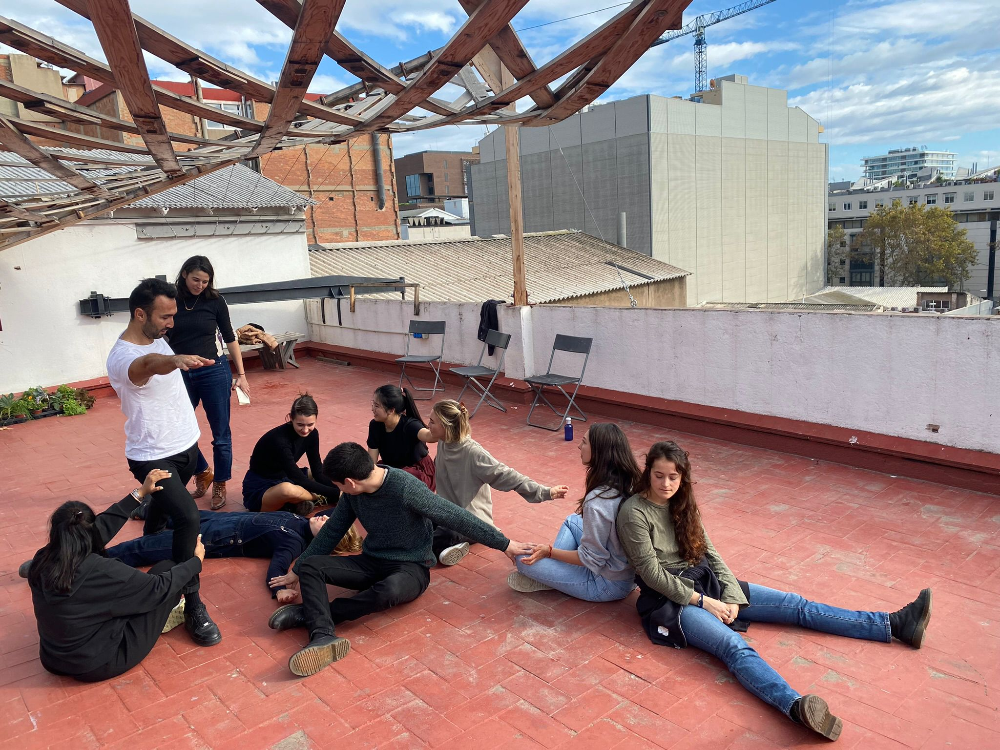

# Community Engagement

## Instructions

*Write a post of your reflection and submit the deliverables on this week's seminar.*

## Conflict and Relations Mapping

I created a map with potential ideas. Collectively as a group (Sami, Ramiro, Cagsun, Antonio and I) we are interested in mental health, neuroscience, human interaction with tech and data, human habits and commodities. I am curious on how these points might potentially converge.

The map shows all the areas of interest in context relating to the potential touchpoint with local communities.

##  Mapping the Local Ecosystem

For this part of the course, we were engaged in a role play to imagine how we can engage in community practice in the shoes of the stakeholders. As a group, it is an interesting experience as it helps to shift focus and perceive the project in other’s perspective. This method would help me to negotiate and communicate with the stakeholders better, since then we can foresee what might be the point of interest for the related parties.

##  Group Work Card Deck

>This was the card that I have chosen from the group work card deck. I would like to remind myself to apply this method in my upcoming design projects. 

I have chosen the card ‘Seeing the Forest, Seeing the Tree’ as it reminds me to perceive the bigger picture in any situation. Also, this shows that the any data collected can be used in many ways, and to know how to use it (whether to look at the summary of the data or individual choices) requires wisdom and experience. This also reminds me of a chinese quote: “当别人看见树木的时候，你要看见整片森林；当别人看见光点的时候，你要看见一颗星星”. It means that when somebody saw a tree, you have to be able to see the whole forest; when somebody sees a light, you have to know  that it is a star. On a wider perspective, I am reminded to take a step back when accessing a situation because sometimes the closer you look, the less you see. Only when you are distancing yourself without involving personal emotions, then you are able to perceive the situation with reason without judgement.

[Group Work Card Deck Info](https://groupworksdeck.org/deck)

## Social Presencing Theory Workshop

>During this workshop, we learned that sometimes we forget that we can retrieve a lot of information from our body and non verbal communication. 

In fact, our actions are actually part of our subconscious mind. As a class, we have embodied assemblages of both human and non-human actants for sensing underlying dynamics and locating opportunities for action. We use “higher educational system” as a general framework and intentionality.

It is interesting to see our 4D model as a cohort as each person might make a different choice. For my case, I was representing “government” in the system. Therefore, I might project my personal experience while representing the actant. 

Both models, before and after, seem like an accurate representation of what the current higher education system is and what the ‘ideal’ education system looks like. The model that represents the current system has a sense of hierarchy in it, and the ‘student’ in the system is at the bottom of the hierarchy. In contrast, in the new ‘ideal’ system, the ‘student’ , depicting a warrior pose, holds an active role in deciding the higher education system. 

## Envisioning My Intervention