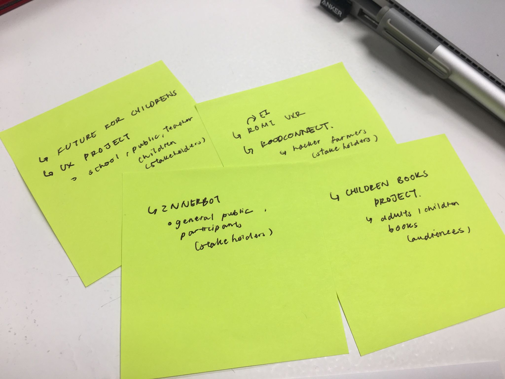
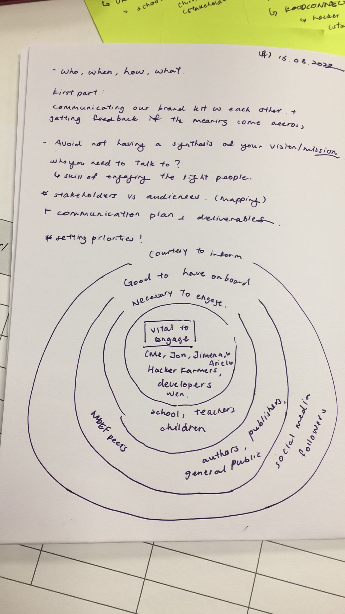
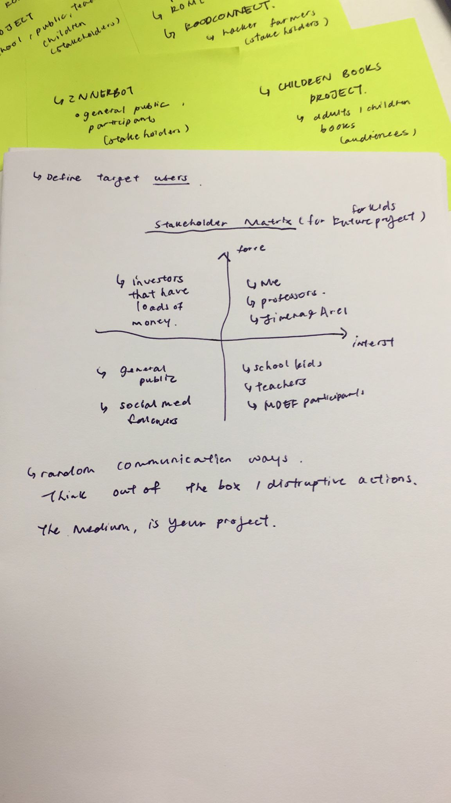
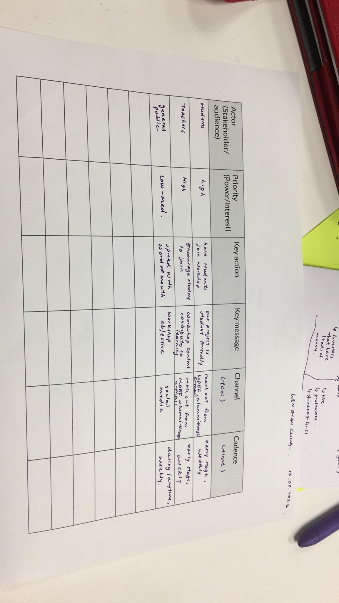

# Communicating Ideas

## Reflection

In this seminar, we are exposed to topics on the importance of communicating Ideas. As a designer, I think it is important to be able to sell  our ideas through effective communication. What makes you different from the others and how do you want to work with other people? Without the skillset of presenting and understanding where you stand, it might be hard to work efficiently in the field that you desire.

During the second class, they are inviting us to think of our work as a holistic thing. One example would be who you are and what you did. Also, with today's activity we would be helping to make sense of what we did last time and see the way it fits into the overall narrative. From this, we are aiming to prepare a communication strategy for the project. One of the examples that I find interesting is this [project](https://www.elisava.net/es/proyectos/designing-realities-project) by a fellow alumni.

During the class activity, we are required to write down our stakeholders/ audience and project that you have.

Then, we gone through something like piority planning. We tried to fit in our stakeholders into different categories.

After that, we classified them into different matrix.

Last but not least, we tried to fill in this form to make sense of our overall project strategy.

## Assignment 

**Purpose**

>As a designer, I am aware that my decision could make a lasting impact on the user and the environment. 

I hope that I can contribute my talent while taking planetary well-being into account.

**Vision**

>I will be adopting an ethics-first design method when considering the accessibility and usability of a product.

For me, it is important to know that my work will bring a positive impact to the people and the environment.

**Mission**

>I design with people. I will be bridging the gap between people and effective systems through empathizing and inclusion. 

I am aware that designers are not users’ and they shouldn’t rely on their assumptions of what the user wants or needs. A good design should be invisible. While approaching design problems, I prioritize usability-over-aesthetics, to me a successful design is when the user can get around the interface and achieve their end goals.

**Minimum Viable Message**

>My research and project would be related to how to increase system efficiency while taking into account negative impacts of my work on users, consumers, citizens, society, taking the planetary well-being into account. 

For me, it’s important to help the most people I can and hurt the least. Right now, I am open to exploring topics related to cognitive and behavioral science, mental health, subconscious mind, child pedagogy and emotions.

**Values**

1. Design Ethics and Planetary Well-being.
2. Designers are not Users.
3. Function over Forms.
4. Punctual and Reliable.

**Personal Brand Kit**

