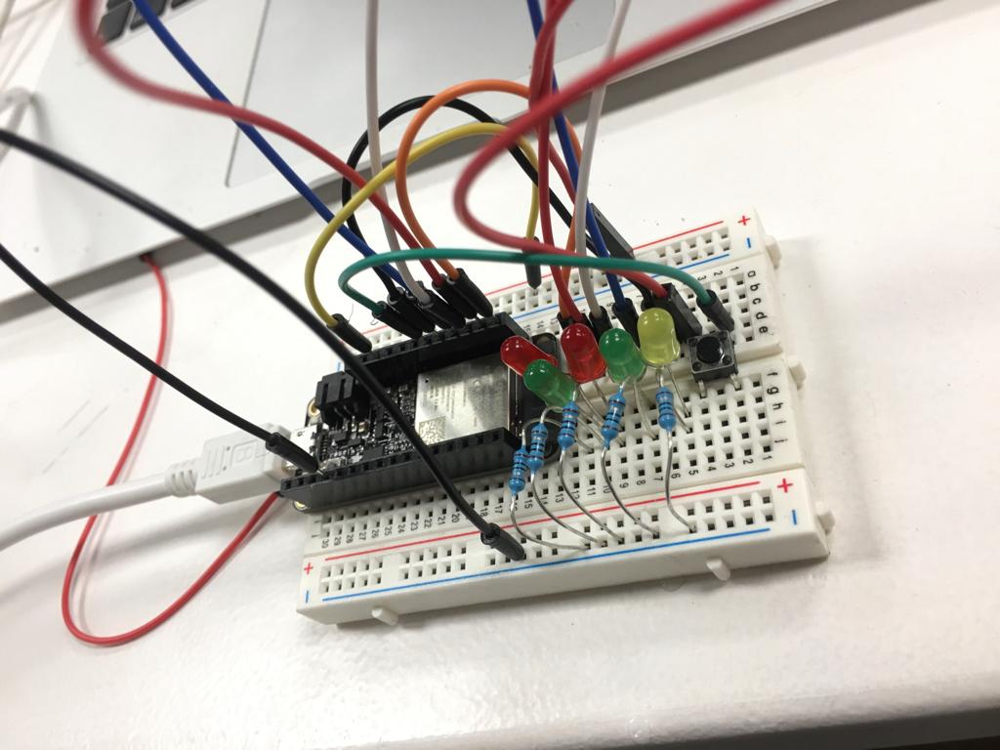

# Digital Prototyping For Design

## Course Website

[General Resources](https://fablabbcn-projects.gitlab.io/learning/educational-docs/mdef/)

## Week 01

### Basic Electronics & Coding

#### Reflection

First week into prototyping and design is quite overwhelming. We have a basic overview on how we should choose the board based on what project we will be using. We also learn about different components on the arduino board. The goal is to find out why we need certain electronics and how we integrate it to our projects. 

For this class, we learn about how to select the right arduino for a project. How do we select the board? What are the aspects we need to think of? Is it the Power? Network? Memory? How to find it and what is the best for you? When selecting the board, it is important to consider the capacity. One quick way is to double check the microcontroller and search for the datasheet on the web to better understand it. When considering what board we should use, it is also important to think about how much power and memory that your [microcontroller](https://fablabbcn-projects.gitlab.io/learning/fabacademy-local-docs/material/extras/week04/whatisamicrocontroller/#now-actually-what-is-a-microcontroller) has.

We also learned the difference between a microcontroller and a computer. Arduino is a lot of things but not a microcontroller, but arduino has microcontroller boards. Arduino is a brand of the board, and it is very amazing because it is an advancement for prototyping ideas. With Arduino, we are able to make prototyping ideas quick and easy. 

The Arduino hardware is completely open source, other manufacturers can easily copy their hardware. The difference here is Arduino invests a lot in their software. They offer us a very simple interface so that it makes communicating to the microcontroller easier. They manage to create a big community of people that uses the same spirit of sharing what they learn on the arduino.

And some general rule of thumb when dealing with coding failure and debugging is to double check your wiring and codes. Try to divide the problem as small as we can to make solving the problem easier.

#### Pictures and Exercises

<iframe src="https://docs.google.com/presentation/d/e/2PACX-1vTTu5YTlQDC95IfjtYJA4m_jAGt1LKTOV_SadOrWzmx7RaRs8DtnnSaVIBJQDnjm55NyKpJgG9hucIe/embed?start=true&loop=true&delayms=5000" frameborder="0" width="960" height="569" allowfullscreen="true" mozallowfullscreen="true" webkitallowfullscreen="true"></iframe>

#### References

For this class, I am mainly looking at the [lecture resources](https://hackmd.io/VBeyTyQoTLev4gjLzZkqQw?view#Electronics-amp-coding) shared on the arduino board.

#### Learning Outcomes

My personal learning outcome for this section is to have a more broader view in electronics and how potentially I would be able to use this knowledge to solve everyday problems. Also, to be able to run a simple code so that the buzzer will play. Personally, I am thankful that there is more flexibility for students to decide the depth of the technical if we want to do more research.

### 2D Design Tools (Parametric Design)

#### Reflection

The class started with a basic group session to learn about the existing software knowledge in modeling. 

>Group Miro Board on the first exercise

<iframe width="768" height="432" src="https://miro.com/app/live-embed/uXjVPrnS_rQ=/?moveToViewport=-15212,3046,18420,12529&embedId=531321577560" frameborder="0" scrolling="no" allow="fullscreen; clipboard-read; clipboard-write" allowfullscreen></iframe>

>We have a better understanding of CAM: Computer aided design. 

We also learned the difference between Vector and Raster files. Vectors are the geometric (mathematical) description of an image. Whereas Raster are mostly made out of pixels, there are essentially small squares and also a memory eater. Most photographs are raster files. The process of changing Raster to pixel is called interpolation. I find this interesting because when I was in architecture school, how I understood vector files is that file that has the x and y axis information. This is essential as when you are using another machine such as a laser cutter, the machine needs the coordinates to precisely cut where we want it to be. We also learned that computers are made out of CPU and GPU, and each of them process different file types.

>We also learned about mesh and nurbs. A mesh model is a collection of vertical, edges and faces. 

We learn that to form a design, it start with points > then connecting it with lines > joining the surfaces > forming polygons to create meshes and you will have your final model. 

This process reminds me a lot of [atomic design](https://atomicdesign.bradfrost.com/chapter-2/). Atomic design is a methodology composed of stages working together to create interface design systems in a more deliberate and hierarchical manner. While it is not exactly the same thing, but I find understanding the parametric in this sense will make your design more accessible and give you full control to it.

I also find it ironic that even though phones get better in showing the amount of pixels per inch, the human eye can only take in 200+ pixels. Yet, more pixels will need more memory from the phone. It makes me feel bad about this aspect of technology as they are using the lack of knowledge of the society in tech as an advantage to market their product. 

Overall, I find it very refreshing and interesting to learn about parametrics again in this context. I will be trying to create some models using rhino and grasshopper to test out some of my ideas.

#### Pictures and Exercises

<iframe src="https://docs.google.com/presentation/d/e/2PACX-1vS2rsrAkr449rfvqFZmDmYsEvzthOOWNndQcTuxsoCvo3MpTW_iPwmGQXku7nO-bcdBKAExYdSzk5ys/embed?start=true&loop=true&delayms=5000" frameborder="0" width="960" height="569" allowfullscreen="true" mozallowfullscreen="true" webkitallowfullscreen="true"></iframe>

#### References

I got most of my data from here: [Lecture Resources](https://fablabbcn-projects.gitlab.io/learning/educational-docs/mdef/classes/design/).

I also did some research and reading on [Zaha Hadid's Parametric Architecture](https://issuu.com/pointnemo_adato/docs/architecture_2bpainting_digital/s/11272890).

#### Learning Outcomes

For this section I hope to understand better different file formats so that I can use it on the right machine effectively. Also, I hope to have a better grasp on Parametric Design and understand how it works. Even though I had used rhino and grasshopper and ladybug before, I am not really familiar in the concept of how parametric works. I aim to explore at least one of the tools for algorithmic design.

## Week 02

### 2D Fabrication (Laser, Vinyl)

#### Reflection

The class started with a basic group session to learn about the technologies in laser cut projects. 

>Group Miro Board on the first exercise

<iframe width="768" height="432" src="https://miro.com/app/live-embed/uXjVPrnS_rQ=/?moveToViewport=8710,1266,9375,7837&embedId=147451757163" frameborder="0" scrolling="no" allow="fullscreen; clipboard-read; clipboard-write" allowfullscreen></iframe>

>For today's course, I learned the different methods of laser engraving. 

We learned the different products that are made with a laser cutter machine. For example, laser engraving, creating a 3D model with the machine etc. 

Laser cutter is a CNC system, and also a computer numerical control (CNC) equipment. We use CAD, computer aided design to produce vector files. 

A laser cut has only two axis, which is X and Y, whereas a 3D printer has 3 axis, which is X, Y and Z. A robotic arm will be working in a 3D space, so it will have 6 axis, which are respectively X,Y, Z, A, B and C.

>We learned about how the machine works, as it uses light amplification by a stimulated emission of radiation.

During the class, we get to see a demo on how it works. Each laser cutter machine has parameters, such as: power, speed , frequency and air compressor. The higher the frequency, the more energy will be focused on the same spot.

The input geometry will need to be a vector or raster file. If it is an image, we can transfer image pixel to a raster friendly version. Overall, I think it is very interesting as when I did projects for my architecture school, there are different settings compared to the current machines we have on fablab. One thing that is notable is that my architecture school has all the materials preset in the laser cutter interface, since it is quite predictable what we will be using as materials. In the fablab, since we can cut anything and almost everything, we really need to pay attention to setting the parameters and testing things out.

We were able to observe the Vinyl cutter machine and see how it works. The difference here is that the Vinyl cutter is not using light beam but a physical knife to cut through the projects. We also get to see an amazing drawing drawn by the Vinyl machine.

Overall, I was able to make a few models from the laser cutter machine. It was a fun experience.

#### Pictures and Exercises

<iframe src="https://docs.google.com/presentation/d/e/2PACX-1vRNyhwWuoEap9Pjpx-XQmUIYydqogrJf3xU5Qvxx2mXxCbztCVVorz6MPE6MLP6RJOMI7X4wv07nl4c/embed?start=true&loop=true&delayms=5000" frameborder="0" width="960" height="569" allowfullscreen="true" mozallowfullscreen="true" webkitallowfullscreen="true"></iframe>

#### References

I got most of my data from here: [Lecture Resources](https://fablabbcn-projects.gitlab.io/learning/educational-docs/mdef/classes/2Dfab/). 

I got my vector files from [here](https://3axis.co/), and click here to download the rhino file of the [3D Sphere](../files/3D%20Sphere/sphere_assembly.SLDASM).

#### Learning Outcomes

I think the key takeaway from this lesson is to learn how to communicate with the machine so that you can execute your design ideas. Also, to consider mutiple spectrum when designing a product, such as thickness, material properties etc as it would affect your project output.

### Inputs / Outputs

#### Reflection

Today’s class is about sensors, inputs and outputs. The reason why input and output is important is because it will help us reveal the info. We also learned about automated system
And a closed loop system: a system that understands what is going on around with the surrounding.

An example for a non close loop system is a 3D printer. They have no input output so they could not tell if they achieve the movement or not, they will just keep going on even if there is some obstacle on the printing bed as there is no sensor on it.

A sensor is a resource for the machine to infer what is happening about the environment. It does not necessarily have to be direct, for example to measure the air quality of the city, we can simply use a sound sensor. We can infer that the sound of the motor vehicle is inversely proportional to the air quality without actually needing a sensor that reads the chemical composition of the air.

I also think the idea of sensor fusion is interesting where we connect multiple sensor and analyze the data. The idea of the amount of sensors our digital devices have sounds alarming, as knowing that our information is being collected at this very moment by big companies and we could not do anything about it quite yet since technology advancement could not keep up with the digital law enforcement.

When going through the list of sensors, I am very interested in the pulse sensor as it makes me think of the lie detector. I found this interesting project [here](https://projecthub.arduino.cc/BuildItDR/41f70368-639d-4833-9534-9a66bceb7ff9) and [here](https://electropeak.com/learn/arduino-lie-detector-polygraph-machine/)

I also think the notion of using graphite as a tool creating non-traditional human interfaces is inspiring. As a Product designer, I have been doing a lot of design on screen. It would be really interesting to design an interface without needing a computer screen. It also brings people back to experiencing technology in a manual and direct manner.

#### Pictures and Exercises

<iframe src="https://docs.google.com/presentation/d/e/2PACX-1vTWVpmYu2kzuPDtEKpxbaU6AcmaMjMJPbbKy22TmOT_xyKst2chXUnKo2NNwJDfVtwVBuQup_RAKYj3/embed?start=true&loop=true&delayms=5000" frameborder="0" width="960" height="569" allowfullscreen="true" mozallowfullscreen="true" webkitallowfullscreen="true"></iframe>

Arduino code for [LDR](../files/Morse%20Code/230209_ESP32_LDR-Test/230209_ESP32_LDR-Test/230209_ESP32_LDR-Test.ino)

Arduino code for [LED](../files/Morse%20Code/230209_ArduinoUNO_LED-Button/230209_ArduinoUNO_LED-Button.ino)

#### References

I got most of my data from here: [Lecture Resources](https://hackmd.io/ECgw7zCkR7WbD5SkcVvcwg?view#How-to-choose-and-use-a-sensors/mdef/classes/2Dfab/)

Click to view [Sensor List](https://hackmd.io/xAjS5n_ASTOmX9EhacRRhw?both#Sensor-list).

#### Learning Outcomes

I think the key takeaway from this lesson is to figure out what would be the best sensor to use in a project. By understanding the direct and indirect relationship each unique sensor has with the output, it will help us in designing the desire system. Also, there is the technical part where I need to brush up as most of the time I find myself struggling making the electronics work. Nevertheless, I definately think that working a cohort together helps in understanding the arduino better.

## Week 03

### Microchallenge I

#### Reflection

>Generally, I think this project creates a lot of opportunity for us to move forward. By making this artifact, I was able to gain more insights on what it takes to actually fabricate a product from start to finish. 

I also feel I am one tiny steps closer to electronics even though there is still a lot of room of improvement. The feedback we received during the presentation is very insightful, we really enjoyed seeing everyone to start playing with it, because it means that it is somewhat successful in terms of engaging people to start a conversation.

#### Project topic

>As a team, we are interested in exploring future perception and attitudes of school children. 

We have worked on a collage exercise to ask 8-year-olds their perspectives reimagining the future of parks, zoos, schools and sports. Therefore we would like to bring it to another level. Questions we asked ourselves involved what we can do to bring the workshop experience to another level? What are the most important aspects when carrying out discussion based activities?

One thing that we noticed from our previous workshop is that sometimes when the kids are having disagreements, they tend to find it hard to come to a satisfying conclusion. Therefore, we think about how we can make this discussion process more diplomatic and inclusive.

Therefore, we came up with an idea of a ‘perception board’, and that allows children and teenagers to map their sentiments, attitudes and perceptions around global problems and their potential solutions. 

**Perception Board**

.jpeg)

.jpeg)

#### Explain your contribution to the project

>In terms of personal contribution, we divided our jobs so that we can work together smoothly based on our strengths.

Ariel is incharge of electronics, to figure out how to fit the LED into the board, and also part of the physical artifact fabrication, while Jimena will be working on the MVP, digital perception board, card and resources design, and also preparing the guides for the game.

I will be in charge of mainly project planning, designing the physical artifact, documentation, and the Rhino File preparation. Even though I came from an architecture background, it has been some time since I used Rhino. For my design process, I started with creating sketches and paper prototypes to figure out the dimensions and the proportion of the elements on the board.

Things that I take into account is the size of each compartment for the pointers, and also what would be the ideal size for children to hold it. I designed the pointer so that there is about 4mm off set space when it is placed on the board. Furthermore, since the distance between the scale on the board need not be based on a real ruler, I separated it based on the distance between the compartments. 

Since the whole board is a 500mm by 500mm square, I divided it using the mirror function on Rhino. To incorporate the LED lights, I made 4mm holes on the 5 points of the board. As a final iteration, I cleaned up the files so that they are ready for upload.

As a collective, we execute main jobs such as laser cutting, assembling and testing together. We also supported each other when we were trying to make the board work.

#### Reflect your learning goals

>I think as a team one of the struggles that we had is electronics. 

.jpeg)

We spend a lot of time figuring out the electronic part. We started with a conceptual product to help facilitate activity with children, and we thought that it would be quite straightforward to put together.

What we learned is that the design process is very delicate and could evolve through making. For example, our first design is a press fit concept with wooden pegs with different colors. However after trying it out, it doesn't work so well as when we try to incorporate other ideas. for the first review, they advise us to combine electronics and also think about what we do with the output of data. They showed us a project of kids documenting their emotions a day and making it into an ice cream.

Also, I learned about how to plan materials more efficiently so that we don’t waste time and resources. This includes having a modular design so that it can be replicated. For future potentials, we thought about using LED strips and also refining our product by designing a card holder for our artifacts.

In conclusion, this is a very enriching experience for me and I love our team’s synergy. We are able to work together as a team efficiently at the same time, learning from each other. We will take all the reviews and feedback into account, and we are excited to bring our project to the next phase. We can consider adding question or wild card

#### References

[Group GitHub Link](https://github.com/wenqianchua/microchallenge-01)

[HackMD](https://hackmd.io/izcCP8XMRhSYw7DjiI5WZQ?view)

[Other Group's Repo](https://docs.google.com/spreadsheets/d/1I9njAn9_ro1NWNcvO2SRhmR0hqt0KgiaekC8czmmWws/edit#gid=0)

[Course Miro](https://miro.com/app/board/uXjVPpFL9hU=/)

[Microchallenge Website](https://fablabbcn-projects.gitlab.io/learning/educational-docs/challenge/c_1/)

## Week 04

### 3D Scanning & 3D Softwares

#### Reflection

The class started with a basic group discussion to learn about the technologies and manufacturing methods.

>Group Miro Board on the first exercise

<iframe width="768" height="432" src="https://miro.com/app/live-embed/uXjVPrnS_rQ=/?moveToViewport=20098,-96,11170,11074&embedId=660094194752" frameborder="0" scrolling="no" allow="fullscreen; clipboard-read; clipboard-write" allowfullscreen></iframe>

>For me, it is surprising to learn that a 3D printer can be built from scratch with materials from your garage and an arduino board.

We learned about 3D printing tech such as FDM and SLA. There is almost everything that we can print. One interesting technique that caught my attention is the [Laminated Object Manufacturing](https://www.sculpteo.com/en/glossary/lom-definition/). It is interesting to see how thin each layer can be to make a 3 dimensional object.

There are also some interesting resources that was shared with us:

1. [Reprap website](https://reprap.org/wiki/RepRap): 3D printer world's wikipedia.

2. A netflix documentary called: Print The Legend, showing how an open source company changed to a closed one.

>In terms of technical knowledge, we learned that to 3D print something, it is important to be able to subdivide the object into multiple sections. 

There is also two types of bonding, by heat or through chemical bond. Some popular 3D printing tech are FDM, SLA, and 3DP. The route of file transfering will take from an STL file, to a Slicer, and then lastly to a 3D printer. There is a flexibility to choose how big is the layer, layer height and etc.

For the infill type, there are 4 main structure: rectangular, triangular or diagrid, wiggle and honey comb. I learned that support is important when printing occurs in air, or if the light needs time etc depending on the time needed for the plastic to cool down. There are many different software that provides design optimized support calculation.

>It is also very important to keep moisture from material to avoid air bubble.

For 3D scanning, it is important because it can help represent the real world to the virtual environment. Overall, I find the new knowledge very interesting and I am grateful to be able to learn about it.

#### Pictures and Exercises

<iframe src="https://docs.google.com/presentation/d/e/2PACX-1vQiDnLdXtaVaJLS3wUjLDSVzZFhpTa50qEr72zv_lFoTMlXoNA2OcqLIcx5MeDT-oMnL7i1KXgmnea1/embed?start=true&loop=true&delayms=5000" frameborder="0" width="960" height="569" allowfullscreen="true" mozallowfullscreen="true" webkitallowfullscreen="true"></iframe>

#### References

I got most of my data from here: [Lecture Resources](https://fablabbcn-projects.gitlab.io/learning/educational-docs/mdef/classes/3dfab/). 

I am interested to experiment with [this](https://cults3d.com/en/3d-model/game/bottle-lid-cat-toys) if I have more time.

#### Learning Outcomes

I think the key takeaway from this lesson is to learn how to use a 3D scanner software and how can I apply this in real life. Question I ask myself includes when would I want to scan an object and print the exact same thing? I would imagine that it is something that has an organic shape, difficult to be drawn in a vector software or some prototype that is hard to manufacture using a laser cutter.

### Networking and Communications

#### Reflection

For this class, I was absent as I was sick, so I self studied and try to understand this based on what was shared on the website. Before this, I have some basic experience and understanding as I was working as a Design Technology Instructor in an international school. We were having a small experiment using the arduino board, connecting to a wifi to control the switch of a light bulb. Even though I don't remember the details, the concept is similar to what I studied from the HackMD website.

>A network (in the context of this class) is a set of devices connected to each other through any type of communication lines that allows the exchange of data between them.

To understand what is an [OSI Model](https://www.imperva.com/learn/application-security/osi-model/), I have also find some helpful resources that helps me a lot in understanding the concept.

**Youtube Video on OSI Model**

<iframe width="560" height="315" src="https://www.youtube.com/embed/vv4y_uOneC0" title="YouTube video player" frameborder="0" allow="accelerometer; autoplay; clipboard-write; encrypted-media; gyroscope; picture-in-picture; web-share" allowfullscreen></iframe>

I think generally I understand the concept. In terms of pracitical application, I find myself struggle a little bit. I will try my best and connect with my peers to see if I can figure it out.

#### Pictures and Exercises

<iframe src="https://docs.google.com/presentation/d/e/2PACX-1vTvosfjoK-afhOcUHfYiQbmatFeGEuD2Lr8PF--vuOm08THXruYVdSlEdsy4unCpMTuI5aFsLogHB0N/embed?start=true&loop=true&delayms=5000" frameborder="0" width="960" height="569" allowfullscreen="true" mozallowfullscreen="true" webkitallowfullscreen="true"></iframe>

#### References

I got most of my data from here: [Lecture Resources](https://hackmd.io/Bl2DDqo6SrOX7SQMwyMbLA?view#Networking-and-communications)

#### Learning Outcomes

The key learning outcome is to understand the concept of network in this class and being able to set up a simple device or through arduino so that they can exchange data between each other. It would be a plus point if I can apply this on my household appliances.

## Week 05

### Interfaces - Machines Interactions

#### Reflection

Today, class started with a lot of hands on work. We saw some examples using LED and arduino in different projects. Then, we proceeded to do some warm up activities. It is very interesting and fun! We enjoyed looking the LED breathe, it is like they are talking to each other. Personally, I prefer doing hands on work during class versus listening to the concept because I feel supported. 

>We also learn about MQTT, a protocol that use in the IoT world. 

The concept is really simple, we will have a server that is called an MQTT-Broker, and it will recieve things and sense things. We will also have publisher (sensor) that can be anything, it could also be a computer. Subscriber will be the devices that listen to the program and they are waiting for the broker to tell them what to do.

Lastly, the class is wrapped up with learning about [Node Red](https://nodered.org/). A raspberry pi is a simple computer. It is very difficult to get it now with the War and supply chain issue going on, but is a really good starting point to work with computer and server.

#### Pictures and Exercises

<iframe src="https://docs.google.com/presentation/d/e/2PACX-1vQ7lgerI-J4PUIXmue-5nad98Jpp8say8theKTflMXYmSsbXQ8q6HmvvUdrnmxHLgnmexSMXWFgL9OG/embed?start=true&loop=true&delayms=5000" frameborder="0" width="960" height="569" allowfullscreen="true" mozallowfullscreen="true" webkitallowfullscreen="true"></iframe>

#### References

I got most of my resources from the [course website](https://hackmd.io/95FEOJXeSXe9hDu289X-bw?view#Interface-machine-vs-machine).

**Finalized Code**

[Blink](../files/arduino/Prototyping%20For%20Design/01_Blink/01_Blink.ino)

[Blink Custom](../files/arduino/Prototyping%20For%20Design/02_BlinkCustom/02_BlinkCustom.ino)

[Blink Jled](../files/arduino/Prototyping%20For%20Design/03_BlinkJled/03_BlinkJled.ino)

[Server Blink](../files/arduino/Prototyping%20For%20Design/04_ServerBlink/04_ServerBlink.ino)

[Server Blink Advanced](../files/arduino/Prototyping%20For%20Design/05_ServerBlinkAvanced/05_ServerBlinkAvanced.ino)

#### Learning Outcomes

For this class, I hope to fix my arduino issues, having a basic understanding on how to control LED lights with a Arduino Board.

### CNC

#### Reflection

Today we learn about CNC. Computer Numerical Control (CNC) machining is a manufacturing process in which pre-programmed computer software dictates the movement of factory tools and machinery. Some facts include CNC products are normally huge, create more waste and have a little filet. The output product could also be more durable. The machines are normally quite heavy, weighing a lot of tons.

The different types of cuts for CNC and normally it is meant for professional use. It works with 3 axes thus we would be able to do 3D / 2D cuts. Or, 2.5D, which is something similar to carving.
It also has a benefit of accuracy. CNC has more accuracy compared to other methods. I am also surprised to learn about a handheld CNC machine, but the accuracy really depends on the user. We also learn about different parts of the CNC part, normally the lower part has a T slot that will help to hold the material.

We also learn about the safety knowledge of handling a CNC. Especially when dealing with collet, it is extremely dangerous as it is a metal that rotates at high speed. It is important to make sure that we are using the right collet with the desired dimension.

To do it nicely, we need about 6-8 screws to make sure everything goes smoothly. There are also different cutting styles for CNC. These are respectively On, Out, and In. Normally, a nesting strategy should be applied because it is expensive and more durable. This will avoid wastage and increase efficiency. If we are out-cutting, it is safe to leave about 22mm spaces between the material. One helpful resource is [svgnest](https://svgnest.com/).

#### Pictures and Exercises

<iframe src="https://docs.google.com/presentation/d/e/2PACX-1vRRqtFtGe9XHQzU766WfK0eQfGSPcv9aIvIkh-Mz2OPpci0IQsMqiN8UV-g_Uq-HIY99HexRVCKsuAh/embed?start=true&loop=true&delayms=5000" frameborder="0" width="960" height="569" allowfullscreen="true" mozallowfullscreen="true" webkitallowfullscreen="true"></iframe>

#### References

I got most of my resources from the [course website](https://fablabbcn-projects.gitlab.io/learning/educational-docs/mdef/classes/cnc/)

#### Learning Outcomes

Through this class, I hope that I will have more confidence when handling CNC machines. I had some experience learning about it in architecture school but not really handling it. Also, I hope to use this knowledge and build something related to our collective intervention.