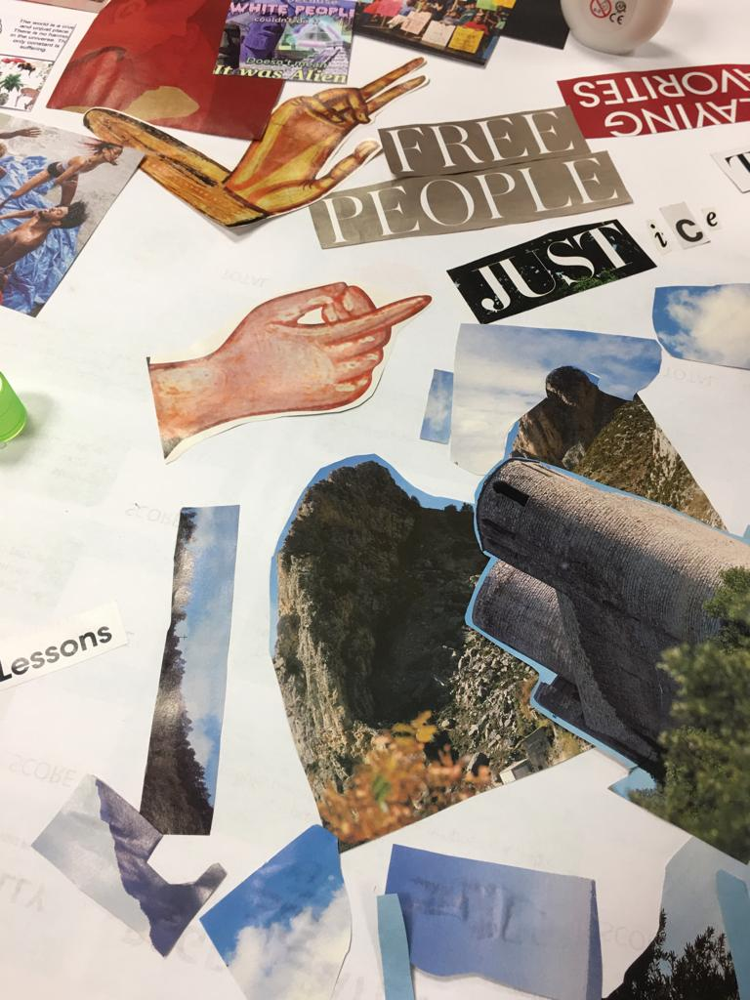

# Distributed Design

## Reflections

In this seminar, we learned about distributed design. It is an interesting introduction to systems thinking + design thinking. I also learned about different groups of people and how to get exposed to exciting student opportunities. I find the notion of system design interesting as it brings the responsibility of the successfulness of a design decision on the efficiency of the system instead of putting it on the shoulders of the stakeholders.

If I were be using a few sentence to summarize what a Mushroom Model does in a design process, I would say that it is great for brain storming, risk checking, product analyzing. I am quite interested to learn more about the parameters to measure the successfulness of the mushroom model and comparing how it is applied to physical and digital product.

During the next day, we learned about why do we measure impact. I learned that it is important as it allows you to understand your project better and it will serve as a good communication tool. If you know what you want to measure, it is a way of letting other people know what’s important to you and create alternative presents where we can extend our projects to a bigger platform.

On the third day, we started the day with an ice breaking activity. Each of us was given a paper and we will be taking turns to draw a portrait of another person. It is a great activity for us to get to know each other. Then we talk about value to find out what is important to you. We decided what value we would be using, in our case, justice, and will be figuring out justice as a framework. 

For the value seminar, the first things that came into my mind were commitment, kindness, resilience, responsibility and selflessness. I think commitment and responsibility is exceptionally important for everything that I do. As a group, we have chosen justice as the value to work on. We did a collage activity where we talked about justice and prepared the collage for a presentation.

Overall, the distributed design seminar provides me a hollistic perspective on my ongoing work and also provide tools in designing a measurement framework for any prospective projects. I would apply what I learn from this seminar and have create a more inclusive and open project. 

### Group Mushroom Model 

On the first day, we choose ChatGPT is our topic.

As an conclusion, we find it quite hard to start a dialougue on this topic as it is quite abstract. Eventually, we were able to exchange opinions and did some research as a group so that we collect useful data to prove our points. The way we move around the mushroom is also quite interesting, we started with making > power > value > knowledge. It is slightly different comparing to the other groups, or example the fertilizer, the bread and the hairpin group.

### Individual/ responses to the Reflection tree with group reflections

<iframe width="768" height="432" src="https://miro.com/app/live-embed/uXjVMURNReQ=/?moveToViewport=-44162,128092,83450,31670&embedId=424013215188" frameborder="0" scrolling="no" allow="fullscreen; clipboard-read; clipboard-write" allowfullscreen></iframe>

### Value Presentation

As a group while doing the collage exercise, we talked about distribution of power, the different spectrum of justice and how do we actually measure it. Most importantly, we think justice is also something that gives a meaning to what we do.

### Reflections

Documenting your process on your web including the following reflections (learning skills, dynamics, interactions) for each day’s activity.

#### Day 01

##### Learning Skils
*Which skills did I need during the activity and how can I translate into something useful for me and my future?*

In terms of hard skills and soft skills, I learned that I would need to know more about history of chatGPT and AI chatbot in general so that I can have a comprehensive view on the subject. I think good communication skills is really important and I am still struggling to express vague ideas to something concrete. I will use this opportunity as a playgorund for me to trial and error on my communication skills.

##### Dynamics
*How was the dynamic inside the group?*

The first session, the dynamic is really great as were able to explore and raise interesting conversation regarding chatGPT. We started from making, power, then value and knowledge. Whereas when we are doing the next session, I find myself talking more as I am the one that's staying behind. I would say that we are quite open minded thus the discussion on chatGPT is rather fruitful.

##### Interactions
*Did the role I played influence my opinion?*

Personally, I am a flexible person and I do not have a strong opinion on things. I am able to be unbias and rational about the opinion taht I would be sharing. As I am representing my group to speak up as a final presentation, I find myself being extra concious that I am just somebody that communicating our ideas. So in short, I do not think that my role has influenced my opinion.

#### Day 02

##### Learning Skils
*Which skills did I need during the activity and how can I translate into something useful for me and my future?*

For today, I learned to be more open minded and being able to access values in a more hollistic way. Using the parameter that is prepared, we are able to collectively discuss and see where our project stands.

##### Dynamics
*How was the dynamic inside the group?*

The dynamic was great as we are working in our existing group. We had a good working experience. Jimena, Ariel and I will be doing the reflection together since we have shared project. Then we had a discussion and reflect on the different areas of the project. In the end there will be a chart where we can see which value that is important to us, how can we improve the project so that it can improve. 

##### Interactions
*Did the role I played influence my opinion?*

No, my opinion is non bias and clear. We were able to remain rational while discussing options and possibilities of our project. 
During the interactions, we were trying to break open value and trying to understand what they mean. The goal of the reflection tree is to help us to evaluate a selected project so we can understand our project impact in relation to the values. I think it is quite insightful.

#### Day 03

##### Learning Skils
*Which skills did I need during the activity and how can I translate into something useful for me and my future?*

For today, the skills that I have is resilience. I am open to changes and able to move forward with my idea even though there is a lot of obstacles. If I will try to talk to more people so that I can test out my ideas. I believe that having conversation with other people is a way of understanding yourself better. This is because as you express yourself, you discover parts of yourself that you never realize.

##### Dynamics
*How was the dynamic inside the group?*

The dynamic was proactive as we are working together with like minded people. We are able to engage in fruitful conversation about justice and power. It is also a nice meditation session while we do our collage. 

##### Interactions
*Did the role I played influence my opinion?*

As a team member, I contributed my part and opinions. We are able to share our own histories and vulnerable thoughts while talking about justice. This is because we think that only those who has suffered with unfair treatment would think justice as something that is necessary. I think my personal history shaped my opinion more than the role that I have in the group did. 

