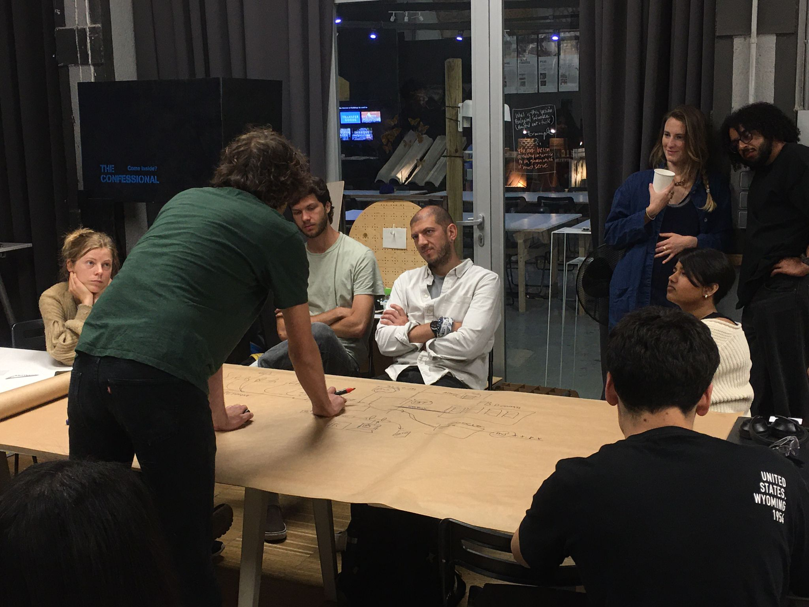
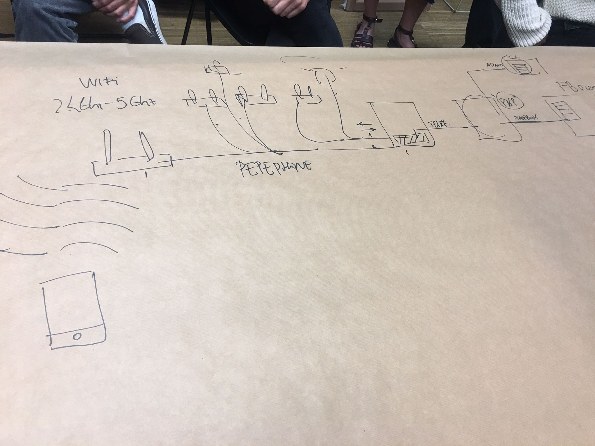
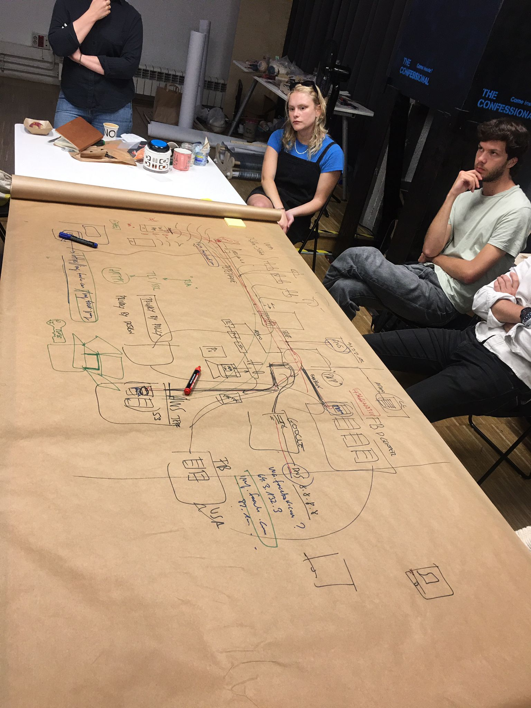

# Decentralized Autonomous Organizations

## Reflections

### Week 01

Today, we started the class with reflecting touch points in our projects. We listed digital protocols such as email, and platforms such whatsapp and instagram that we used in the intervention. The point of us doing this is to understand how we are interacting with the protocol or platform, and this reminds me of service design.

Then, we shared about the objectives of the tech track during the 3rd term. We also have a more comprehensive view in learning about Big Tech. It is also worth noting that creating a product is a complex process. It requires a lot of critical thinking and seeing the big picture. It is important to explore the full potential of a product as time changes.

Our world is filled with technology. Most of the tech that we use everyday is part of the marketing campaign of the tech company. It dictates how we deal with everything in life. If we think about common tools, it actually takes years to master a physical tool. Thus it is important to think about the time it takes you to understand how a tool works, even when it is not tangible. This is because nowadays, a common digital tool is getting easier and easier to learn and manage, but also at the same time, the output of the tool becomes increasingly similar. 

As time advances, we design interfaces to improve the experience of us interacting with the technology. Behind the pretty interfaces in technology, from the input to output, there are actually a lot of hidden layers. As designers, we are going to use a lot of technology, thus to be responsible, we need to be aware of the notion that technology is not neutral. Most people have forgotten or perhaps never realized how radical and powerful is technology that we can access on an everyday basis. For example, on the web, by default you can select and copy text and share information easily. It is too easy to extract things. Thus, the concept of decolonising technology emerges. Technology is not as simple like what google does, it is more complicated. It is important to move from extractive to regenerative technology to have a more equitable experience to all users.

The Internet is always marketed as a ‘free’ service, but is it really? Something that is free does not necessarily mean that it is available to all. Thus, when big companies use the notion of ‘providing free service’ to justify whatever decision they have to make, in reality to monetize and extract data, it is not really fair to all the people from unprivileged places.

In the end, we did a simple reverse engineering from our digital lives. We did a map to understand better how information is being passed in the digital world, things that happened behind the scene. Personally, I think it is very insightful because the digital experience is almost like a black box and no one really knows what is going on. By understand the behind the scene processes, it is more helpful to design recognizing issues such as privacy and rights to certain data.

In conclusion, it is a very enriching experience, I learned a lot from this session and I would apply the knowledge that I learn in my future design decisions.

#### Homework

First thing that comes into your mind when I think of block chain, NFT etc are:

- Digitalized currency
- Freedom of creating art
- Right of art ownership
- Independent source of money

### Week 02

In the second class, we talked about some projects. One of the projects is about power. We were introduced to the approach on how to research using design tools or artistic research methods in order to see the effects of power. How can power, and how we are inscribed in power relations, and how it is affecting us in terms of emotion, behavior and mental health. The quote “Self care can’t cure social disease. Action dries your tears. Most of us are not doctors.” It is an interesting disclaimer when relating to mental health issues.

We are also learning about proposals on an open protocol. When we are working with some specific tools, it is important to have a protocol. It can be open, it means it is a protocol that needs or should be reviewed within every specific situation. Being in a happy space doesn’t mean you don’t need a protocol or a good practice code to execute it. All of them share a commitment of taking care in terms of politics, ethics, ontology and epistemology. 

In every design process,iIt is important to recognize who is not there. In my opinion, I think this is a valid notion as those who are missing are those that are most underrepresented. What is toxic? Pure? Artificial? Pure? Sometimes, separating things into yes or no, or black and white makes it really easy for people to be divided and focus on the differences. In my opinion, a lot of the time there is no right or wrong, good or bad. Things are just being. If we separate things and try to classify things, we assign positive or negative attribution to the classification.

One of the great questions that we need to consider is that when we are working on something, who are we actually working for? This is important because it provides clarity in a situation. It raises awareness, so that our talents and contribution will not be used in the wrong manner. The second part will be about design justice. We talked about different practices and proposals. There is a list of 10 design justice principles, however it seems like there are not too many approaches in academia to use these principles.

In conclusion, I find all the projects that were shared during class to be very insightful. There is so much opportunity to work with fiction. They open up different perspectives when viewing subject matters.
