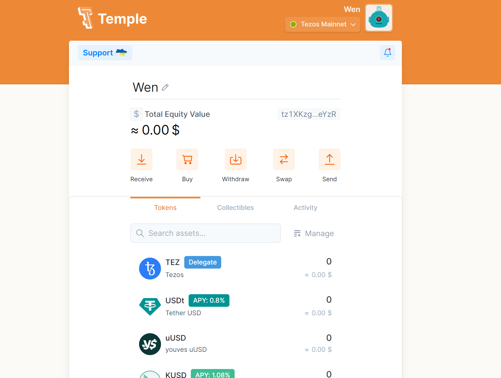

# Collective Intelligence

## Reflections

[Course Syllabus](https://mail.google.com/mail/u/0/#inbox/FMfcgzGsmWwpnXnpgTHrJSTJQQwbrMhV?compose=new&projector=1&messagePartId=0.1)

### Day 01

In the Collective Intelligence class, we learn a lot about NFT and different workshops. There was a sharing session on a series of projects such AI aided ceramic sculpture project, bridging deep learning with materiality. In this class, we learn about NFTs, web3.0 and Bitcoin as a crypto currency system.

Many jobs will need retraining technology in the next five years. Software is eating the world, but subscription is eating the software. It is interesting to learn about how many subscriptions that our classmates are doing on the website. We also learned about the 10 industries that blockchain will disrupt in future. This includes: banking, cybersecurity supply chain management, healthcare, government, insurance, transportation, cloud storage, real estate, art and design.

It is very important to understand distributive systems and centralized systems. We learn about how block chain works, such as the concept of proof of work and proof of stake. It is important to learn about blockchain wallets because it will determine the amount of control that you have to them. For example, when you upload things on the web, you have no control over the content that you upload. In the other time, we have full control of wallet and assets if it is software on a smartphone, table or PC Users. While when it is a hardware wallet, also known as cold wallet, then you could access your cryptos stored offline. It is important to check your wallet on a second computer to avoid disappointment, as an accident might happen. At the end of the class, we set up a Tezos wallet and experimented with it.

As a group with Jime and Ariel, we had an extensive conversation about how we might potentially use AI to compliment on our projects. One of the ideas we had is to use the data collected from our intervention, converting text to image using AI. Potentially, we could use the image generated to conduct an exhibition.

### Day 02

On the second day, we spend the first session setting up our digital wallet. These are some links that we used for the purpose:

[IPFS](https://ipfs.tech/)

[TZ Profile](https://tzprofiles.com/connect)

Most of our class time is spent deploying the wallet. This is my link for the wallet:
tz1XKzgLFcftsgEqcr1zti7bE3cMNxRGeYzR

For the second part of the class, we tried to have a better understanding of NFT. Personally, I am really thankful for NFT because in some way, they recognize the ownership of the original artist. No matter how many times that the art is being resold, the original owner is still recognized and paid. While there is also controversy as when you can make a screenshot, you technically ‘own’ the art. We are also introduced to a couple artists, such as Masaki Fujihata, the first artist using GPS to create NFT artwork. He also had a creative way of selling the NFT, he tried reverse for selling his NFT, using the highest price for the first buyer. In the end, he managed to convince someone to be the first person and the art was doing well. In the market, there are also some NFT that are sold as objects.

We were also introduced to the three clusters of NFT Art Markets platforms by volume of sales. There is Large scale, Medium Scale and Small scale. Large scales are more dangerous, as there is no gatekeeping and a wide range of content. Whereas for Medium Scale, it is more restricted by entry or limited by the type of art its shown, or both. Whereas for small scale, it is more reliable, safe and easier to buy. 

Then we created a market place [here](https://objkt.com/profile/tz1XKzgLFcftsgEqcr1zti7bE3cMNxRGeYzR/collections). While there were options to creat art from here [AI Art Resources] (https://huggingface.co/spaces/stabilityai/stable-diffusion), since I am a painter, I have chosen one of my previous work.

In the end, I have succesfully listed my NFT in the market place. [My art](https://objkt.com/asset/KT1LWZDB)

### Day 03

For the first session of the class, we were introduced [Processing](https://processing.org/) as a simple way to start in coding and graphic programming. There is a really cool project that has been made into NFT in Barcelona, the Living Architecture project at Casa Batlo.

We were also introduced to DAO. Dao is a decentralized autonomous org that uses blockchain to facilitate self enforcing rules and protocols. We were introduced to several projects that are related to DAO. Example, there is this [project](https://jlt.ltd/) that seems interesting. I think it is interesting that he is disguised as a chatbot and documented all the conversations over the years.

After, we had a sharing session to share about what are the potentials in incorporating things that we learned for the past few days in our project. 

#### Deliverables

<iframe src="https://docs.google.com/presentation/d/e/2PACX-1vS7rJwWXSReQExywpBW0bKPvWJt6kfyu8u5uicM768OtuHFyZ6dbZo0FX_O9AjlF3kmqMihafSfdh_j/embed?start=true&loop=true&delayms=3000" frameborder="0" width="960" height="569" allowfullscreen="true" mozallowfullscreen="true" webkitallowfullscreen="true"></iframe>