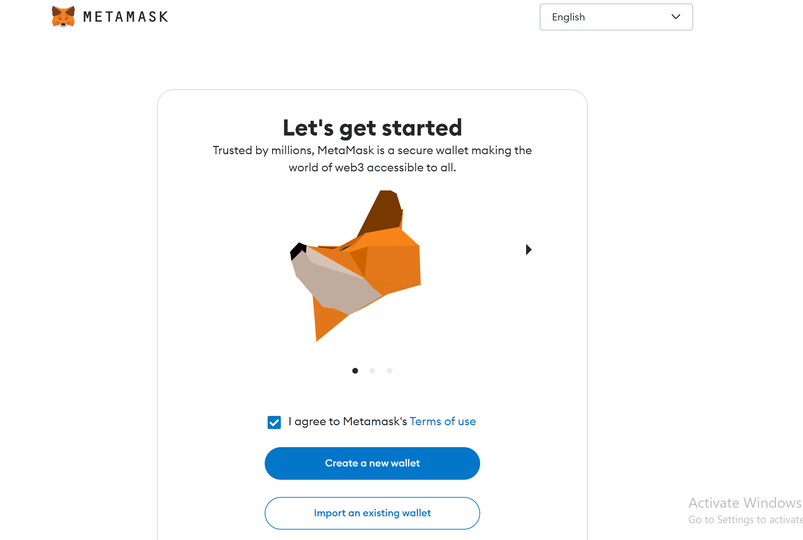
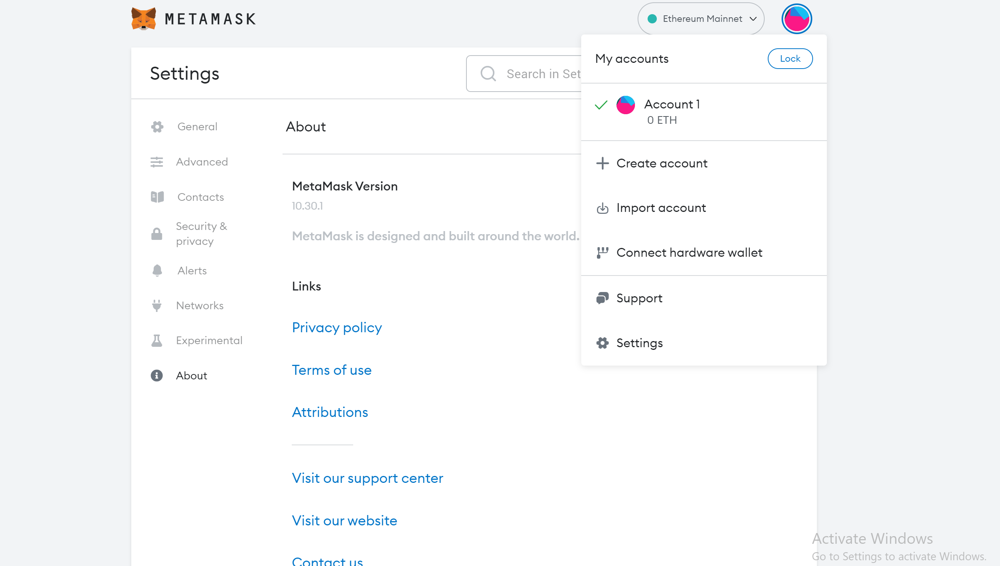

# Collective Intelligence

## Reflections

### Day 01

In the Collective Intelligence class, we learn a lot about NFT and different workshops. There was a sharing session on a series of projects such AI aided ceramic sculpture project, bridging deep learning with materiality. In this class, we learn about NFTs, web3.0 and Bitcoin as a crypto currency system.

Many jobs will need retraining technology in the next five years. Software is eating the world, but subscription is eating the software. It is interesting to learn about how many subscriptions that our classmates are doing on the website. We also learned about the 10 industries that blockchain will disrupt in future. This includes: banking, cybersecurity supply chain management, healthcare, government, insurance, transportation, cloud storage, real estate, art and design.

It is very important to understand distributive systems and centralized systems. We learn about how block chain works, such as the concept of proof of work and proof of stake. It is important to learn about blockchain wallets because it will determine the amount of control that you have to them. For example, when you upload things on the web, you have no control over the content that you upload. In the other time, we have full control of wallet and assets if it is software on a smartphone, table or PC Users. While when it is a hardware wallet, also known as cold wallet, then you could access your cryptos stored offline. It is important to check your wallet on a second computer to avoid disappointment, as an accident might happen. At the end of the class, we set up a Tezos wallet and experimented with it.

As a group with Jime and Ariel, we had an extensive conversation about how we might potentially use AI to compliment on our projects. One of the ideas we had is to use the data collected from our intervention, converting text to image using AI. Potentially, we could use the image generated to conduct an exhibition.

